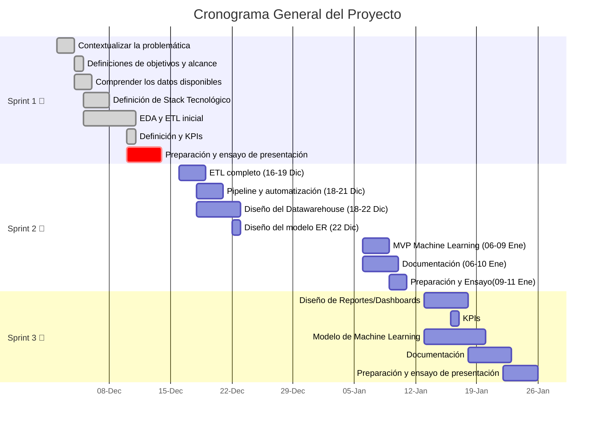

|  |  |  |
|:---:|:---:|:---:|
| [Ir a Sprint 1](#sprint-1) | [Ir a Sprint 2](#sprint-2) | [Ir a Sprint 3](#sprint-3) |

### 
  ☕Proyecto: 

# 
 📊 Análisis de Inversión 

## 
 🥐 Coffee & Brunch Bussiness 

### Sprint 1

## 📚Índice del SPRINT 1
##### 📚Índice
| Sección                         | Enlace                           |
|--------------------------------|----------------------------------|
| **Items que tiene que tener la propuesta**          | [Equipo de trabajo](#equipo-de-trabajo) |
|                                | [Entendimiento de la situación actual](#entendimiento-de-la-situación-actual) |
|                                | [Objetivos](#objetivos)          |
|                                | [Alcance](#alcance)              |
|                   | [KPIs](#kpis)                    |
|          | [Repositorio Github](#repositorio-github) |
| **Hitos**                      |                                  |
|                         | [3KPIs](#kpis)                   |
| | [Alcance](#alcance)              |
|              | [EDA de los datos](#eda) |
|             | [Repositorio Github](#repositorio-github) |
|             | [Stack Tecnológico](#stack-tecnológico) |
|          | [Metodología de trabajo](#metodología-de-trabajo) |
|                | [Diseño detallado](#diseño-detallado) |
|        | [Cronograma general Gantt](#cronograma-general-gantt) |
| | [Análisis preliminar de calidad de datos](#análisis-preliminar-de-calidad-de-datos) |
| **Documentación:**                      |                                  |
|                                |     [Stack elegido y fundamentación](#Cronograma-general-Gantt)|
|                                |    [Flujo de trabajo](#Flujo-de-trabajo)|
 
---

# 🚀Equipo de Trabajo:
# ¿Quienes Somos? 

# ☕ **Datanova: Datos que Impulsan Decisiones Estratégicas**  

En **Datanova**, convertimos datos en herramientas clave para el crecimiento y la innovación. Nos complace presentar nuestra propuesta para **apoyar la expansión de su negocio**, un referente en el sector **Coffee & Brunch Business**.  

Nuestro enfoque está centrado en ayudarle a **identificar las mejores ubicaciones** para sus nuevos locales, reduciendo riesgos y maximizando el **potencial de retorno**.  

### 🎯 **Nuestra misión**  
Transformar sus objetivos en resultados concretos, aprovechando el poder de los datos para diseñar una **estrategia exitosa y sostenible**.

---
Presentación de Nuestro Equipo de Ciencia de Datos
| 📊 **Analistas de Datos** | 🛠️ **Ingenieros de Datos** | 🤖 **Ingenieros de Machine Learning** |
|---------------------------|---------------------------|--------------------------------------|
|  |  |  |
| **Claudia Jara y Saray Pacheco**   Expertas en explorar, interpretar y visualizar los datos, Claudia y Saray son clave para descubrir patrones, generar insights estratégicos y presentar información clara que facilita la toma de decisiones. | **Diana Moreno y Sergio Castro**   Diana y Sergio se especializan en diseñar y mantener la infraestructura de datos, asegurando que la información sea accesible, eficiente y escalable para proyectos de alta complejidad. | **Felipe Dedes y Greta Combold**   Felipe y Greta lideran el desarrollo de modelos predictivos e implementan soluciones de machine learning que automatizan procesos y generan sistemas inteligentes con impacto real. |

## Juntos, combinamos nuestras habilidades para transformar datos en valor, aportando innovación y resultados efectivos.
***

[⬆️ Volver al índice](#índice)

*** 

¨
# 🔍📊Entendimiento de la situación actual
_"El mercado de cafeterías boutique y brunch está en pleno auge. La creciente demanda por experiencias gastronómicas únicas y la búsqueda de ambientes acogedores lo convierten en un sector atractivo, pero también competitivo.
Sin embargo, los principales desafíos para la expansión incluyen:

1- **Identificar zonas con alta demanda potencial.**

2- **Evaluar la rentabilidad proyectada en cada ubicación.**

3- **Reducir riesgos asociados a la competencia y baja afluencia de público.**

A partir de estos puntos clave, hemos diseñado un análisis que responde directamente a estas inquietudes y ofrece una guía estratégica basada en datos."_

[⬆️ Volver al índice](#índice)

# 🎯✨Objetivos 

###### Objetivo Específicos:
1. **Realizar un Análisis Exploratorio de los Datos disponibles en Yelp y Google maps (incluir
aquí la otra fuente de dato si aplica)**
2. **Realizar un ETL que permita integrar datos de diversas fuentes y transformarlos en una
estructura unificada.**
3. **Definir el pipeline**
4. **Realizar el despliegue de datos en nube que facilite la ingesta de datos y alimentar el
modelo de machine learning.**
5. **Desarrollar un modelo de machine learning para predecir las oportunidades de inversión
basadas en los KPIs definidos.**
6. **Elaborar un dashboard de los KPIs e información clave de consulta.**

[⬆️ Volver al índice](#índice)

# 📏🌍Alcance

Este proyecto se centra en realizar un análisis integral del mercado para apoyar la expansión estratégica del negocio 'Coffee & Brunch Business'. Consideramos los siguientes puntos clave dentro del alcance:
1. **Recopilación y procesamiento de datos provenientes de Yelp, Google Maps y otras fuentes relevantes.**
2. **Diseño e implementación de un ETL para integrar y estructurar los datos en un formato unificado.**
3. **Identificación de zonas de alto potencial mediante análisis geoespacial y evaluación de métricas clave.**
4. **Desarrollo de un modelo predictivo de machine learning para estimar oportunidades de inversión.**
5. **Creación de un dashboard interactivo para la visualización de KPIs e insights relevantes.**
Este alcance está diseñado para ofrecer resultados accionables y maximizar el retorno de inversión, alineándose con los objetivos de crecimiento del negocio.

ALCANCE Este proyecto incluirá el análisis y limpieza de datos disponibles en Yelp y Google Maps para negocios de cofee and breakfast en Estados Unidos, la elaboración de un dashboard interactivo con la visualización de datos claves y Kpi y la implementación de un modelo de machine learning para predicciones y recomendaciones sobre la expansión de este tipo de negocio.
Este proyecto no incluye la Integración en tiempo real con las plataformas Yelp o google maps, análisis de información por fuera de Estados Unidos ni tampoco estrategías de marketing de expansión que se puede desarrollar en una siguiente etapa.

[⬆️ Volver al índice](#índice)
***

# 📈🔎EDA
# Análisis Exploratorio de Datos
 
Durante las primeras dos semanas, nos enfocamos en la **recopilación**, **limpieza** y **análisis de datos** provenientes de **Google Maps** y **Yelp**.  

El objetivo principal de este **Análisis Exploratorio de Datos (EDA)** fue identificar **oportunidades estratégicas** para su negocio a través de los siguientes enfoques clave:  

---

### 🚀 **1. Crecimiento**  
- Identificar **zonas** con alta concentración de la **población objetivo** y **potencial de expansión**.  

---

### 🗺️ **2. Competencia**  
- Mapear la **presencia** y **distribución** de negocios similares para evaluar la **densidad competitiva**.

---

### ⭐ **3. Factores Clave de Éxito**  
- Detectar **atributos comunes** en los negocios más exitosos, tales como:  
   - 📍 **Ubicación estratégica**  
   - 🛎️ **Características del servicio**  
   - 😊 **Nivel de satisfacción del cliente**  

---

## 📈 **Resultados y Visualizaciones**  

Presentaremos **visualizaciones claras y precisas** que mostrarán:  
1. 🗂️ Los **datos brutos** recopilados.  
2. 🧹 Los resultados tras la **limpieza y análisis**.  

Por ejemplo, destacaremos:  
- 🌟 Áreas con **mayor potencial de crecimiento**.  
- ⚠️ Zonas que presentan **riesgos** debido a la **saturación del mercado**.  

---

## 🎯 **Conclusión**  
Estas conclusiones servirán como base para **identificar las mejores oportunidades de negocio**, facilitando la toma de decisiones **estratégicas** y **rentables**. 🚀  

---

---

## 📊 **Análisis de la Base de Datos de Yelp**  

### 🗺️ **Distribución General de Comercios**  
En la base de datos de **Yelp**, identificamos aproximadamente **150,000 comercios** ubicados en **1,416 ciudades** de **Estados Unidos**.  

🔍 Como lo muestra el **primer gráfico**, las ciudades con mayor concentración de negocios son:  
- **🏙️ Philadelphia**: 9.7%  
- **🌵 Tucson**: 6.15%  
- **🌴 Tampa**: 6%  

---

### ☕ **Negocios en las Categorías Objetivo**  
Dado que el foco del cliente está en negocios de **Coffee & Tea** y **Breakfast & Brunch**, analizamos estas categorías en detalle.  

📊 El **segundo gráfico** revela:  
- **Total de negocios**: **11,758**  
- **Ciudades analizadas**: **616 ciudades** de Estados Unidos  

### 🌟 **Ciudades con Mayor Concentración**  
Los negocios de **Coffee & Tea** y **Breakfast & Brunch** se encuentran mayormente en:  
- 🏙️ **Philadelphia**  
- 🌴 **Tampa**  
- 🎷 **New Orleans**  
- 🌵 **Tucson**  
- 🎸 **Nashville**  

🔝 **Philadelphia** se destaca como la ciudad con la **mayor cantidad de negocios** en estas categorías en todo Estados Unidos.  

---

## 🎯 **Conclusión**  
El análisis de la base de datos de **Yelp** permite identificar ciudades estratégicas para la expansión del negocio, destacando **Philadelphia** como la ciudad líder en este segmento.  

--- 

## 📝 **Análisis de Reseñas de la Base de Datos de Yelp**  

### 🔎 **Resumen General de Reseñas**  
En la base de datos de **Yelp**, encontramos:  
- **7 millones de reseñas** escritas por los usuarios.  
- **1,147,000 reseñas** corresponden a la categoría **Coffee & Breakfast**.  

---

### 📊 **Distribución de Reseñas por Ciudades**  
El **gráfico azul** revela la concentración de reseñas por ciudad, destacando:  
- 🏙️ **Philadelphia**  
- 🎷 **New Orleans**  

Estas dos ciudades concentran la **mayor cantidad de reseñas** del dataset, lo que indica un **alto interés del público** en estos negocios en dichas ubicaciones.  

---

### 👥 **Cantidad de Usuarios con Reseñas**  
En cuanto a los **usuarios** que han dejado reseñas en negocios de **Coffee & Breakfast**, identificamos:  
- **574,000 usuarios** activos.  
- Distribuidos en **616 ciudades**.  

Las ciudades con **mayor cantidad de usuarios** son:  
- 🏙️ **Philadelphia**  
- 🌴 **Tampa**  
- 🎷 **New Orleans**  
- 🏁 **Indianápolis**  

---

## 🌟 **Conclusión**  
Los datos reafirman a **Philadelphia** como un destino **clave y estratégico** para este tipo de negocios, al concentrar tanto la **mayor cantidad de reseñas** como de **usuarios activos**.  

---

### 📌 **Puntos Destacados**  
- **Reseñas Totales**: **7M**  
- **Reseñas Coffee & Breakfast**: **1.1M**  
- **Usuarios con Reseñas**: **574K**  
- **Liderazgo por Ciudad**: 🏙️ **Philadelphia**  

---

---

## 🗂️ **Análisis del Dataset de Google**  

Para el dataset de **Google**, se analizaron:  
- 📊 **2.9 millones de negocios**  
- 📝 **89.9 millones de reviews**  
- 📅 Periodo: **Abril 2002 - Septiembre 2021**  

---

### 📑 **Categorías de Análisis**  
- Se identificaron **4,461 categorías distintas**.  
- Seleccionamos las **50 categorías de comida más relevantes**, las cuales representan **más del 90%** de los reviews totales asociados a establecimientos de comida.  

---

### ☁️ **Wordcloud: Palabras Más Relevantes**  
A partir de las **50 categorías principales**, extrajimos las palabras con mayor aparición y generamos la siguiente **nube de palabras** (Wordcloud).  

🔍 Las palabras más relevantes identificadas fueron:  
- **"fast"**, **"food"**, **"takeout"**, **"pizza"**, **"coffee"**, **"cafe"**  

📝 **Interpretación**:  
Esto sugiere que la categoría **coffee** tiene una **fuerte presencia** en el mercado de comida estadounidense.  

---

### ⭐ **Rating Medio por Categoría**  
Al calcular el **rating promedio** de las categorías, observamos lo siguiente:  
- ☕ Los establecimientos asociados a **Coffee** presentan un **rating elevado**, lo que indica una **alta satisfacción del cliente**.  
- 🍟 En contraste, los locales de **comida rápida** (Fast Food) se encuentran entre los **peores calificados**.  

---

## 🎯 **Conclusión**  
El análisis destaca que los negocios de **Coffee** no solo tienen una **fuerte presencia en el mercado**, sino que también son percibidos con **alta calidad** por parte de los consumidores. En comparación, los negocios de **comida rápida** muestran una menor calificación promedio, lo que refleja oportunidades para mejorar en este segmento.  

---

## 📊 **Análisis de Tendencias en Coffee Shops**  

### 🗓️ **Establecimientos Únicos por Periodo**  
Tras filtrar los locales a categorías asociadas a **Coffee Shops**, evaluamos la **frecuencia trimestral** de establecimientos presentes en los reviews.  

🔍 **Hallazgos**:  
- El sector muestra una **tendencia de crecimiento constante**.  
- 📉 Se identificó un periodo de **decaída** que podría estar asociado a la **pandemia**, reflejando su impacto temporal en el sector.  

---

### ⭐ **Rating Promedio por Periodo**  
A pesar de la caída en la cantidad de establecimientos durante la pandemia:  
- 📈 El **rating promedio** de los coffee shops ha mostrado un **aumento constante** a lo largo del tiempo.  

### 🔎 **Posible Interpretación**:  
- **Competencia del sector**: La mejora en el **servicio y calidad** como respuesta a un mercado más exigente.  
- ☕ **Aceptación del público**: Mayor preferencia por este tipo de establecimientos, donde el café y el ambiente social juegan un papel importante.  

---

### 📌 **Conclusión General**  
Los términos **"coffee"** y **"shop"** destacan en el análisis, lo cual refleja:  
- ☕ La **popularidad** de las cafeterías como espacios clave para **socializar** y **trabajar**.  
- 🇺🇸 Una consistencia con la **cultura estadounidense**, donde el café ocupa un lugar **central** en la rutina diaria.  

---

## 🎯 **Relevancia para el Negocio**  
El crecimiento sostenido y la alta aceptación del público por los **coffee shops** los posicionan como una **oportunidad estratégica** para nuevos emprendimientos en el sector.  

--- 

---

## 🗺️ **Relación entre Coffee-Shops y Densidad Poblacional**  

### 🔥 **Mapa de Calor: Distribución de Coffee-Shops**  
En el **mapa de calor** (izquierda), podemos observar la **concentración de establecimientos de coffee-shops** en Estados Unidos:  
- 📍 Mayor densidad en las **costas este y oeste**, destacando a **New York** como el estado con mayor presencia.  
- 🏜️ Menor densidad en la zona **central** del país, especialmente en estados como **Nevada**, **Wyoming** y **Montana**.  

---

### 🗺️ **Mapa Coroplético: Densidad Poblacional**  
El **mapa coroplético** (derecha), generado con datos del **United States Census Bureau**, muestra la **densidad poblacional** por condado.  

### 🔎 **Comparación Visual**  
Al comparar ambos mapas:  
- Se observa una **relación directa** entre la **densidad poblacional** y la **cantidad de coffee-shops**.  
- 📈 Las zonas con **mayor densidad de población** tienden a tener una **mayor concentración** de establecimientos.  

---

### 📉 **Análisis de Correlación**  
- El cálculo de correlación lineal arroja un valor de **0.45**, lo que indica una **relación moderada** entre ambos factores.  
- Sin embargo, esta correlación **no es lo suficientemente fuerte** como para ser un **predictor confiable** por sí sola.  

---

## 🎯 **Conclusión Estratégica**  
Para el negocio de **coffee shops**:  
- La **densidad poblacional** es un factor **importante**, pero **no definitivo**.  
- Es crucial analizar otros factores que podrían influir en la **presencia** y el **éxito** del rubro, como:  
   - 📍 **Ubicación y accesibilidad**  
   - 👥 **Perfil demográfico del consumidor**  
   - 🛠️ **Nivel de competencia local**  
   - 💼 **Tendencias de consumo y hábitos de los usuarios**  

---

[⬆️ Volver al índice](#índice)
***

 # 📊📏KPIs

# 📊 **Indicadores Clave de Desempeño (KPIs)**  

En un **mercado competitivo**, el éxito y crecimiento de un negocio dependen de **decisiones fundamentadas en datos**. Por ello, hemos diseñado un sistema de medición basado en **Indicadores Clave de Desempeño (KPIs)** que permiten **rastrear y optimizar** aspectos esenciales como:  

- 📈 **Satisfacción del cliente**  
- 🔍 **Visibilidad del negocio**  
- 🛒 **Conversión hacia compras efectivas**  

Este enfoque, sustentado en **tecnología avanzada**, asegura una gestión **estratégica y escalable**.

## ✨ **KPIs Definidos**  

 

### 📌 **KPI 1: Sentimiento  --> Meta trimestral = 5%** 
S (Crecimiento de comentarios positivos)
- **Descripción**:  
   Monitorea el **sentimiento de los comentarios** para conocer la **opinión del consumidor**. Se calcula como el **porcentaje de comentarios positivos** respecto al total de comentarios del periodo.  
- **Fórmula**:  
  
Fórmula: % de crecimiento de comentarios positivos = [(Total comentarios positivos periodo actual - Total comentarios positivos periodo anterior) / Total de comentarios positivos periodo anterior] * 100

- **Meta**: ✅ **5%**  

---

**KPI2:**

### ⭐ **KPI 2: Puntuación Promedio**  
- **Descripción**:  
   Mide el **promedio de las calificaciones** dejadas por los usuarios durante un periodo, reflejando la **satisfacción del cliente** de manera cuantitativa.  
- **Fórmula**:  
   
   \text{Puntaje promedio} = \frac{\text{Sumatoria total de puntajes del periodo}}{\text{Total de usuarios que dejaron calificación}}
   
- **Meta**: ✅ **3.8**  

---
 
**KPI3**

### 🚀 **KPI 3: Tasa de Crecimiento de las Calificaciones**  
- **Descripción**:  
   Monitorea el **crecimiento de la visibilidad** del negocio basado en el **número de reseñas** recibidas en el periodo.  
- **Fórmula**:  
   \[
   \text{Porcentaje de crecimiento de calificaciones} = \frac{\text{(Total comentarios periodo actual - Total comentarios periodo anterior)}}{\text{Total comentarios periodo anterior}} \times 100
   \]  
- **Meta**: ✅ **2%**
- ---

---

## 🎯 **Resumen**  
Estos **KPIs** nos permitirán analizar y mejorar continuamente el desempeño del negocio, asegurando una **mejor experiencia del cliente**, mayor visibilidad y un crecimiento sostenible. 🚀 

[⬆️ Volver al índice](#índice)
# Flujo de Trabajo

# 🚀Pipeline 

### 🌟 **Introducción**
Este proyecto implementa un pipeline de datos **robusto y escalable** que permite la **ingestión**, **transformación**, **almacenamiento** y **visualización** de datos. Además, incluye la integración de modelos de **Machine Learning** y **control de versiones** para garantizar calidad y reproducibilidad.

---

### 🔗 **Resumen del Pipeline**
**Flujo Completo**:  
**Data Source → Transform → Warehouse → Machine Learning → Visualization.

El pipeline cubre desde la ingestón de datos hasta la visualización, automatizando tareas y garantizando eficiencia.

---

### 🛠️ **Arquitectura del Pipeline**

1. **🛠️ Local Transform (Procesamiento Local)**:
   - Herramientas: **Apache Spark**, **Python** *(pandas, matplotlib, numpy)*.
   - Actividades: Exploratory Data Analysis (**EDA**), limpieza y transformaciones iniciales.

2. **💾 Data Source (Origen de Datos)**:
   - Fuentes de datos:
     - **APIs**: Google Map Places 📍, Yelp Fusion 🔎.
     - Subida manual: Archivos **CSV**, **JSON**.

3. **📈 Transform (Transformación de Datos)**:
   - **BigQuery** 📂: Almacenamiento y consulta SQL.
   - **Cloud Dataflow** 🛠️: Procesamiento escalable y en streaming.
   - **Cloud Functions** ⚙️: Automatización de tareas adicionales con Python.
   - **Cloud Scheduler** ⏰: Programación de tareas recurrentes.

4. **🏛️ Warehouse (Almacén de Datos)**:
   - **BigQuery** 📁: Actúa como **Data Warehouse** central.

5. **🤖 Machine Learning**:
   - Modelado con:
     - **TensorFlow** 💡 y **Scikit-learn** 🔬.
   - Despliegue con **Streamlit** 📺 para interfaces interactivas.

6. **📊 Visualization (Visualización de Datos)**:
   - Herramienta: **Power BI** 🔍.
   - Propósito: Dashboards interactivos para el análisis y presentación de resultados.

7. **🔒 Version Control (Control de Versiones)**:
   - **Git** ⚒️ y **GitHub** 💼: Control de versiones y colaboración.
   - **GitHub Actions** ⏳: Automatización de CI/CD.

---

### 🔄 **Flujo del Pipeline**
1. **💡 Ingestión de Datos**:
   - Datos obtenidos de **APIs** o subida manual.
2. **🛠️ Transformación Local**:
   - EDA y limpieza con **Apache Spark** y **Python**.
3. **💾 Carga a la Nube**:
   - Datos subidos a **BigQuery**.
4. **🛠️ Transformación en la Nube**:
   - Procesamiento con **Cloud Dataflow** y automatización con **Cloud Functions** y **Scheduler**.
5. **📁 Almacenamiento**:
   - Datos transformados almacenados en **BigQuery**.
6. **🤖 Machine Learning**:
   - Entrenamiento de modelos con **TensorFlow/Scikit-learn**.
   - Visualización de resultados con **Streamlit**.
7. **📊 Visualización Final**:
   - Dashboards interactivos con **Power BI**.
8. **⚒️ Control de Versiones**:
   - Automatización y control con **Git**, **GitHub** y **GitHub Actions**.

---

### 🧰 **Tecnologías Principales**
- **BigQuery** 📂: Almacenamiento y consulta de datos.
- **Cloud Dataflow** 🛠️: Procesamiento escalable.
- **TensorFlow / Scikit-learn** 🤖: Modelado de datos.
- **Streamlit** 📺: Interfaces interactivas.
- **Power BI** 🔍: Visualización de resultados.
- **Git / GitHub** 💼: Versionado y CI/CD.
- **APIs**: Google Map Places 📍, Yelp Fusion 🔎.

---

### 🚀 **Este pipeline está diseñado para ser escalable, automatizado y fácil de usar**. 🚀

[⬆️ Volver al índice](#índice)

## 🛠️🧩💻**Stack Tecnológico**

El pipeline utiliza un **stack de herramientas escalable** y eficiente:

### ⚙️ **Procesamiento de Datos**:
- **Apache Spark** 🛠️: Procesamiento distribuido.
- **Python** ✨: Lenguaje principal.
   - Bibliotecas: **pandas**, **numpy**, **matplotlib**.

### 📂 **Almacenamiento en la Nube**:
- **BigQuery**: Data Warehouse.
- **Cloud Dataflow**: Procesamiento escalable.
- **Cloud Functions**: Automatización.
- **Cloud Scheduler**: Programación de tareas.

### 🤖 **Machine Learning**:
- **TensorFlow / Scikit-learn**: Desarrollo y evaluación de modelos.
- **Streamlit**: Interfaces interactivas.

### 📊 **Visualización**:
- **Power BI**: Dashboards y análisis.

### ⚒️ **Control de Versiones**:
- **Git y GitHub**: Versionado del código.
- **GitHub Actions**: Automatización CI/CD.

### 💾 **Ingestión de Datos**:
- **APIs**: Google Map Places, Yelp Fusion.

---

### 🎯 **Beneficios del Stack**
- ✨ **Escalabilidad**: Manejo eficiente de grandes volúmenes.
- 🔄 **Automatización**: Menos procesos manuales.
- 🔒 **Reproducibilidad**: Versionado con Git/GitHub.
- 📺 **Interactividad**: Visualización clara con Streamlit y Power BI.

---

## 📝🧩 Metodología de trabajo

Para **organizar nuestro trabajo** y **dirigir nuestros esfuerzos** hacia nuestras metas, hemos elegido trabajar con **metodologías ágiles** bajo el marco de trabajo **SCRUM** 🚀.

Este enfoque nos permite:

- ✅ **Mejorar la organización de tareas**: Asignando responsabilidades claras y manejando tiempos eficientemente.  
- 🤝 **Fomentar la colaboración**: Promoviendo la comunicación constante y el trabajo en equipo.  
- 🔄 **Adaptarnos rápidamente a los cambios**: Flexibilidad ante nuevas necesidades o retos del proyecto.  
- 📦 **Asegurar entregas continuas**: Iteraciones incrementales que mantienen el producto alineado con nuestros objetivos.\n\nTrabajar bajo **SCRUM** nos garantiza un flujo de trabajo **transparente**, **eficiente** y **enfocado en la entrega de valor**, permitiendo la mejora continua durante todo el desarrollo.

---

[⬆️ Volver al índice](#índice)

## ⏳📅Cronograma General Gantt

El cronograma general del proyecto se detalla a continuación, dividido en secciones como inicio, análisis, desarrollo y finalización. Utilizamos un diagrama de Gantt para visualizar el progreso de cada tarea.

**Cronograma General: Hitos y Entregables**

"El proyecto está diseñado para ser entregado en seis semanas, con presentaciones cada dos semanas.

**Semana 1-2:**

EDA inicial con datos de Google Maps y Yelp.
Gráficos que muestren la información limpia y general.
Definición de KPIs y fórmulas, junto con las metas iniciales.

**Semana 3-4:**

Implementación de un modelo predictivo para analizar la rentabilidad de las zonas priorizadas.
Mapas interactivos que representen el análisis geoespacial.

**Semana 5-6:**
Finalización del dashboard interactivo.
Presentación de recomendaciones finales y conclusiones basadas en los KPIs.

**Hitos:**

Desarrollo de herramientas visuales.
Documentación clara del análisis.
Recomendaciones estratégicas accionables."

[⬆️ Volver al índice](#índice)

# 🔗📂Repositorio Github

  📂EDA
   
   Analisis Preliminar Google:  
      
   EDA Google: 
      
   Analisis Preliminar Yelp: 
      
   EDA Yelp:
      
  📂ETL
  
    ETL Google 
      
    ETL Yelp 
    
 📂Data
  
Google: 
 [Data Google](https://drive.google.com/drive/folders/1r-C75XM0gNzKiJPa97j-8HIiqtOzaz42)
     
Yelp: 
[Data Yelp](https://usantotomaseduco-my.sharepoint.com/personal/dianamorenoa_usantotomas_edu_co/_layouts/15/onedrive.aspx?id=%2Fpersonal%2Fdianamorenoa%5Fusantotomas%5Fedu%5Fco%2FDocuments%2FYELP%2Ddatasets&ga=1)

         
Census
      
  -- READ.ME

[⬆️ Volver al índice](#índice)

***
"Estamos convencidos de que este proyecto será el punto de partida para la expansión exitosa de su negocio. Nuestro trabajo no solo busca identificar ubicaciones rentables, sino también brindarle herramientas que faciliten decisiones basadas en datos sólidos y confiables.
Hoy le presentamos los primeros resultados de este proceso. A medida que avancemos, le mostraremos más hallazgos, siempre con la misión de maximizar su éxito en este sector tan competitivo."

### Contacto:
#### Claudia Jara Yañez:
Rol: Data Analyst

Github:https://github.com/claujara1975

Linkedin: https://www.linkedin.com/in/claudia-jara-1517361a5/

#### Saray Pacheco Ramos:
Rol: Data Analyst  

Github: https://github.com/ssaraypr

#### Sergio Castro: Limpieza y análisis del dataset Google.
Rol: Data Engineer

Github:https://github.com/SDCaFlo

LinkedIn: 
#### Diana Moreno: Limpieza y análisis del dataset Yelp.
Rol:  Data Engineer

Github: https://github.com/dianitafeliz

LinkedIn:
#### Felipe Dedes : Machine learning y despliegue.
Rol: Machine Learning Engineer

Github:https://github.com/DedesF

LinkedIn:
#### Greta Combold: Machine Learning y despliegue.
Rol: Machine Learning Engineer

Github: https://github.com/PerlaMarGreta

LinkedIn:

[⬆️ Volver al índice](#índice)
### Sprint 2 

## 📚Índice del SPRINT 2
# Proyecto: 🌟 Predicción de Crecimiento Económico para Negocios de ☕ Coffee & 🥐 Brunch

## 📚 Índice
| 🗂️ Sección                                | 🔗 Enlace                                     |
|-----------------------------------------|---------------------------------------------|
| **🛠️ Elementos del ETL**                | [ETL completo](#etl-completo)               |
|                                         | [📊 Estructura de datos implementada](#estructura-de-datos-implementada) |
|                                         | [🚀 Pipeline ETL automatizado](#pipeline-etl-automatizado) |
|                                         | [📐 Diseño del Modelo ER](#diseño-del-modelo-er) |
|                                         | [🔄 Pipelines para alimentar el DW](#pipelines-para-alimentar-el-dw) |
|                                         | [🏢 Data Warehouse](#data-warehouse)         |
|                                         | [🤖 Automatización](#automatización)         |
|                                         | [✔️ Validación de datos](#validación-de-datos) |
|                                         | [📜 Documentación](#documentación)           |
|                                         | [📈 Diagrama ER detallado](#diagrama-er-detallado) |
|                                         | [📚 Diccionario de datos](#diccionario-de-datos) |
|                                         | [🔧 Workflow detallando tecnologías](#workflow-detallando-tecnologías) |
|                                         | [🔍 Análisis de datos de muestra](#análisis-de-datos-de-muestra) |
| **📅 Ciclo de vida del dato**           | [🔄 Ciclo de vida del dato](#ciclo-de-vida-del-dato) |
| **💡 Prototipos y Productos**           |                                             |
|                                         | [🤖 MVP/ Proof of Concept de producto de ML](#mvp-proof-of-concept-de-producto-de-ml) |
|                                         | [📊 MVP/ Proof of Concept de Dashboard](#mvp-proof-of-concept-de-dashboard) |

---

Así, el **ciclo de vida del dato** se encuentra antes de los productos y prototipos, proporcionando una visión clara sobre cómo se gestionan y procesan los datos antes de ser utilizados en la creación de modelos y dashboards.
## 🔍 **🛠️ Elementos del ETL**

### 🌐 ETL completo
El proceso de **ETL** incluye:
- 📥 **Extracción** de datos desde fuentes como 🗺️ Yelp, 🗺️ Google Maps y Census.
- 🔄 **Transformación** y limpieza de datos para garantizar calidad y uniformidad.
- 🚀 **Carga** en un **📊 Data Warehouse** centralizado en BigQuery.

### 📊 Estructura de datos implementada
La estructura sigue un modelo optimizado para consultas analíticas:
- 🗂️ Tablas principales: Negocios, reseñas, ventas, usuarios y datos demográficos.
- 📈 Cada tabla está diseñada para consultas rápidas y modelado predictivo.

### 🚀 Pipeline ETL automatizado
El pipeline incluye:
- 🤖 Automatización para extracción, transformación y carga.
- ✔️ Validación de datos para garantizar integridad y consistencia.
- 🕒 Ejecución programada semanalmente para mantener actualizados los datos.

### 📐 Diseño del Modelo ER
El modelo incluye:
- 🔗 Relaciones entre negocios, usuarios y ventas, destacando interacciones clave.
- 🗺️ Tablas auxiliares para datos geográficos y demográficos.
- Claro, aquí tienes los textos bien estructurados con emojis para que puedas agregarlos a tu GitHub:

El **diseño del modelo ER** para el sistema de análisis de datos de negocios incluye una estructura conceptual y global de las entidades y sus relaciones. A continuación, se destacan los elementos clave:

- 🏢 **Entidad central: `business`**  
  Representa los negocios registrados, con información relevante como nombre, dirección, ciudad, estado, coordenadas, categorías y atributos específicos del negocio. Esta entidad está relacionada con varias otras entidades secundarias.

- 🔗 **Entidades relacionadas:**
  - 📝 `reviews`: Almacena reseñas realizadas por usuarios, asociadas a negocios y usuarios, con detalles como texto, calificación y utilidad.
  - 👤 `user`: Representa a los usuarios del sistema, incluyendo atributos como nombre, número de reseñas y promedio de estrellas.
  - 📅 `checkin`: Registra las visitas a los negocios en fechas específicas.
  - 💬 `tip`: Contiene consejos o comentarios breves hechos por los usuarios, vinculados a los negocios.
  - 💵 `sales`: Registra información sobre ventas por trimestre y año, asociada con los negocios.
  - 🌍 `google_misc`: Información complementaria de Google vinculada a cada negocio.
  - 🌎 `population_per_state`: Proporciona datos demográficos por estado y año, útil para análisis en modelos de **machine learning**.

El modelo **ER** es de tipo **copo de nieve**, lo que significa que las entidades están **normalizadas** en tablas pequeñas y específicas, lo que ayuda a reducir redundancias y optimizar el análisis.

Este diseño conceptual establece las bases para la estructura de la base de datos y organiza la información de forma clara y eficiente, optimizando la velocidad y precisión del análisis.

---

### 🔄 Pipelines para alimentar el DW
Los pipelines automatizados alimentan el **📊 Data Warehouse** con:
- 📅 Datos actualizados de Yelp, Google Maps y Census.
- 🆕 Nuevas reseñas y ventas trimestrales, asegurando datos recientes.

### 🏢 Data Warehouse
El **Data Warehouse** centraliza y organiza datos para análisis y modelos predictivos:
- ⚡ Optimizado para consultas analíticas y reportes.
- 📈 Configuración escalable para soportar crecimiento de datos.

### 🤖 Automatización
Todo el proceso es automatizado con:
- 🕒 Workflows programados que ejecutan tareas críticas.
- ☁️ Cloud Functions y herramientas de GCP para orquestar operaciones.
Link del video para ver el proceso:
[Link del video](https://drive.google.com/file/d/1keAXoYo-qoZnxgP-6pQOmW9OrGWwkflr/view?usp=sharing)

### ✔️ Validación de datos
El pipeline incluye pasos de validación para:
- 🗑️ Eliminar duplicados y detectar inconsistencias.
- 📊 Garantizar que los datos cumplen estándares de calidad esperados.

### 📜 Documentación
La documentación incluye:
- 📋 Detalles técnicos del proceso ETL y su implementación.
- 🛠️ Instrucciones claras para ejecución y mantenimiento.
- 🖊️ Manuales para incorporar nuevas fuentes de datos.

### 📈 Diagrama ER detallado
El diagrama **ER** detalla:
- 🗂️ Tablas principales, auxiliares y sus relaciones.
- 🔑 Claves primarias y foráneas, destacando conexiones de datos.

El **diagrama ER detallado** es la representación visual precisa y técnica del diseño de la base de datos. En este diagrama se muestra:

- 🔠 **Entidades**: Las tablas principales y sus atributos específicos.
- 🔗 **Relaciones**: Las conexiones entre las entidades, indicando cómo se vinculan y la cardinalidad de las relaciones.
- 🔑 **Llaves primarias (PK) y foráneas (FK)**: Se especifican las claves que identifican de manera única cada registro y las relaciones entre las tablas.
- ⚖️ **Restricciones y tipos de datos**: Información detallada sobre las restricciones aplicadas a los campos (por ejemplo, campos no nulos) y los tipos de datos asociados a cada atributo.

A continuación, se presenta un **diagrama ER detallado** de la estructura de la base de datos, donde se incluyen las **tablas** y sus **relaciones**:

  
*(Imagen representando la estructura detallada de las tablas y sus relaciones)*

Este diagrama ofrece una visión completa y técnica de la estructura, permitiendo una implementación precisa de la base de datos en el sistema. Los detalles como **tipos de datos**, **llaves primarias y foráneas**, y las relaciones entre las entidades son fundamentales para garantizar la integridad y el rendimiento del sistema.

---

En resumen:
- El **Diseño del Modelo ER** proporciona una visión **conceptual** del sistema, estructurando las entidades y sus relaciones de manera global.
- El **Diagrama ER Detallado** se enfoca en los aspectos **técnicos**, presentando la estructura precisa de las tablas, relaciones y claves.

La **imagen con las tablas y sus relaciones** debe ir en la sección del **Diagrama ER Detallado**, donde se visualizan todos los detalles técnicos.

## 📚 Diccionario de datos

El diccionario describe:
- 🏷️ Estructura de las tablas: nombres, tipos de datos y relaciones.
- 🖊️ Definición clara de cada campo y su propósito dentro del modelo.
- Aquí tienes el texto estructurado y con emojis para agregarlo a tu GitHub:

---

## 📚 Diccionario de Datos

En este repositorio podrán encontrar un **diccionario de datos** que ofrece una descripción detallada y precisa de cada uno de los elementos que conforman el modelo. Este documento incluye información clave como:

- 🏛️ **Entidades y tablas**: Las tablas que estructuran los datos.
- 🧩 **Atributos de cada entidad**: Detalles específicos de cada campo o columna dentro de las tablas.
- 🔢 **Tipos de datos**: Los tipos de datos asociados a cada campo.
- 🔑 **Llaves primarias (PK)**: Identificadores únicos para cada registro.
- 🔗 **Llaves foráneas (FK)**: Definen las relaciones entre las tablas.
- ⚖️ **Restricciones o reglas aplicadas**: Reglas que garantizan la integridad de los datos.

La imagen que presentamos corresponde a una sección del **diccionario de datos** y muestra la estructura de una de las tablas de la base de datos. En ella podemos observar:

- 📝 Los **atributos** que forman parte de la tabla.
- 🔠 Los **tipos de datos** asociados a cada campo.
- 📋 La **descripción detallada** de cada atributo.
- 🔑 La **clave primaria**, que permite identificar de manera única a cada registro.

### 🔧 Workflow detallando tecnologías
El workflow utiliza:
- 📊 **BigQuery** para almacenamiento y análisis de grandes volúmenes.
- ☁️ **Cloud Functions** para integración y tareas automatizadas.
- 🔗 APIs externas como Yelp y Census para extracción de datos críticos.

### 🔍 Análisis de datos de muestra
El análisis de muestra incluye:
- 🔎 Exploración de datos históricos para identificar tendencias relevantes.
- 📊 Segmentación de negocios por ubicación, reseñas y ventas.

---

## 🚀 **💡 Prototipos y Productos**

## 🤖 MVP/ Proof of Concept de producto de ML
Modelo inicial para predecir crecimiento basado en:
- 💰 Ventas, ⭐ reseñas y 📍 ubicación.
- 🧠 Algoritmos supervisados como 🌲 Random Forest y 📈 XGBoost.
- 📊 Variables clave: promedio de reseñas, densidad de negocios y datos demográficos.
Aquí tienes un resumen estructurado para la sección MVP de ML de tu README en GitHub, con algunos emojis para hacerlo más visual y amigable:

---

## 🚀 MVP de Machine Learning

En este proyecto, hemos desarrollado un modelo de **Machine Learning** para predecir el **crecimiento económico de negocios de café** utilizando datos clave como:

- 📊 **Reseñas de clientes**
- 💰 **Ventas mensuales**
- 📍 **Ubicación de los negocios**

### 🔍 Modelo de Predicción

El modelo se entrena con **datos históricos de ventas** y **valoraciones** para estimar el **porcentaje de crecimiento de las ventas** en los próximos meses. Utilizamos un **RandomForestRegressor** para identificar patrones entre las características de cada negocio y su desempeño.

### 🌟 Interfaz Interactiva

Creamos una **interfaz interactiva** con **Streamlit** que permite a los usuarios:

- 🗺️ **Explorar negocios de café** mediante un **mapa interactivo** filtrado por ubicación, reseñas, ventas y otras variables.
- 🔍 **Visualizar predicciones de crecimiento** con filtros personalizables.
- 🏢 **Ingresar direcciones** y obtener una lista de negocios cercanos con su predicción de crecimiento.

### ⚡ Optimización y Resultados

- 🏃‍♂️ **Optimización del proceso** con **BigQuery** para ofrecer resultados rápidos y precisos.
- 📈 **Modelo entrenado previamente**, lo que garantiza la eficiencia en las predicciones.
- 📊 **Diseño intuitivo** que facilita la interpretación de los datos y toma de decisiones informadas.

---

Este formato destaca los puntos clave de forma clara y visual, usando emojis para hacerlo más atractivo.
### 📊 MVP/ Proof of Concept de Dashboard

Dashboard interactivo para visualizar:
- 📈 Predicciones del modelo con gráficos claros e intuitivos.
- 🔎 Datos clave: ventas, puntuaciones y tendencias trimestrales.
- 🎛️ Filtros por ubicación, período y características específicas.

**🔍 Insights accionables con nuestro Dashboard interactivo:**

1️⃣ **Secciones Temáticas**: El dashboard está dividido en áreas específicas para visualizar datos clave.  
2️⃣ **📊 KPIs y Tendencias**: Paneles con KPIs (✅ verde = cumplido, ❌ rojo = no cumplido) y análisis de tendencias. Ejemplo: **Incremento en Ventas (+4%)**.  
3️⃣ **🎛️ Filtros**: Aplica filtros por 🗓️ años o 📍 ubicaciones para explorar:  
   - Cantidad de negocios.  
   - Ciudades con más negocios.  

**🔎 Análisis Temático:**

- **💬 Reseñas**: Tendencia trimestral de reseñas, ranking de ciudades con más reseñas 🌟, y un mapa de distribución geográfica.  
- **⭐ Puntajes**: Evolución del puntaje promedio por ciudad 📍, identificando áreas con más interacciones.  
- **📍 Ubicaciones**: Mapa interactivo de ⭐ estrellas por negocios, con filtros para observar zonas con menos o más calificaciones.  

**📈 Análisis Avanzado:**
Ejemplo:  
- Chicago: ⭐ 4.3 promedio, 492 negocios.  
- New York: ⭐ 4.16 promedio, 1,810 negocios.  
Esto muestra que cantidad ≠ calidad, indicando posibles factores como servicio superior en Chicago.

**⚙️ Funcionalidad:**  
Conectado a **BigQuery** para consultas actualizadas e interactivas en tiempo real. 🎯

✨ Este dashboard es una herramienta poderosa para decisiones estratégicas, optimizando el crecimiento de negocios Coffee & Brunch. ☕🥐
---

### Sprint 3

## 📚Índice del Proyecto

##### 📚Índice del Sprint 3
| **Sección**                        | **Enlace**                            |
|-----------------------------------|---------------------------------------|
| **Hitos**                         |                                       |
|                                   | [Diseño de Reportes/Dashboards](#diseño-de-reportesdashboards) |
|                                   | [KPIs](#kpis)                        |
|                                   | [Modelos de ML](#modelos-de-ml)       |
|                                   | [Modelo de ML en Producción](#modelo-de-ml-en-producción) |
|                                   | [Documentación](#documentación)       |
|                                   | [Selección del Modelo y Feature Engineering](#selección-del-modelo-y-feature-engineering) |
|                                   | [Informe de Análisis](#informe-de-análisis) |
| **Rúbrica**                       |                                       |
|                                   | [Objetivos Tech](#objetivos-tech)     |
|                                   | [Diseño del Dashboard](#diseño-del-dashboard) |
|                                   | [Funcionalidad y Usabilidad](#funcionalidad-y-usabilidad) |
|                                   | [KPIs (Rúbrica)](#kpis-rubrica)       |
|                                   | [EDA / Feature Selection](#eda--feature-selection) |
|                                   | [Modelo Machine Learning](#modelo-machine-learning) |
|                                   | [Modelo ML en Producción (Rúbrica)](#modelo-ml-en-producción-rubrica) |

---

# Hitos

## Diseño de Reportes/Dashboards

El dashboard interactivo diseñado tiene un Panel de Navegación intuitivo y se organiza en diferentes pestañas, cada una con un enfoque específico.
Las pestañas incluyen Reseñas, Valoraciones, Ventas, Ubicaciones, Puntajes, y Conclusiones. Cada pestaña está enfocada en proporcionar información relevante para la expansión del negocio, con visualizaciones y KPIs.
Estructura y estética: El diseño incluye filtros y gráficos interactivos (como el de ventas y puntajes) que facilitan el análisis.

## KPIs

Los KPIs definidos son:
Crecimiento de la puntuación promedio (meta 2%)
Crecimiento de las ventas (meta 4%)
Crecimiento en la cantidad de reseñas (meta 2%)
Crecimiento de los comentarios positivos (meta 2%)
Cada KPI se visualiza en el dashboard para permitir un análisis fácil y rápido.

## Documentación

Se ha documentado todo el proceso: desde la limpieza de datos y recolección hasta el desarrollo de modelos y el diseño del dashboard.
Además, la presentación final incluye los hallazgos clave y el análisis detallado de los KPIs.

## Selección del Modelo y Feature Engineering

Detalla el proceso de selección del modelo y las técnicas de feature engineering utilizadas.

## Informe de Análisis

El análisis de los datos de reseñas, valoraciones y ventas se presenta a través de gráficos interactivos que muestran tendencias y patrones, lo que facilita la interpretación para tomar decisiones estratégicas
# Rúbrica

## Objetivos Tech

Documenta los objetivos tecnológicos del proyecto.

## Diseño del Dashboard

El análisis de los datos de reseñas, valoraciones y ventas se presenta a través de gráficos interactivos que muestran tendencias y patrones, lo que facilita la interpretación para tomar decisiones estratégicas

## Funcionalidad y Usabilidad

El dashboard es completamente interactivo, lo que garantiza una funcionalidad y usabilidad óptimas para los usuarios.
Las visualizaciones son claras, y los usuarios pueden filtrar y explorar los datos fácilmente.

## KPIs (Rúbrica)

Describe los KPIs evaluados para la rúbrica.

## EDA / Feature Selection

Explica cómo realizaste el análisis exploratorio de datos y la selección de características.

## Modelo Machine Learning

Se han desarrollado dos modelos de machine learning:
Análisis de Sentimientos: Para medir el nivel de satisfacción del consumidor a partir de los comentarios de los clientes.
Prediccion de Exito: Para predecir el potencial económico de nuevas ubicaciones.
Ambos modelos están diseñados para facilitar la toma de decisiones estratégicas basadas en datos.
Los modelos de ML se enfocan en el análisis de sentimientos y la estimación del impacto económico de las ubicaciones. Estos están en producción y operativos en la nube.
Explicacion del Modelo de Analisis de sentimientos:

# **Modelo de Sentimientos** 🧠💬

Para el análisis de sentimientos de las **reseñas de los clientes**, utilizamos técnicas de procesamiento de lenguaje natural (**NLP**) y un modelo preentrenado llamado **RoBERTa** 🚀. Este modelo es una variante optimizada de **BERT** y fue utilizado para clasificar las reseñas en tres categorías: 

- **Negativo** ❌
- **Neutro** 😐
- **Positivo** ✅

## **Procedimiento Inicial** 🏁
En un primer intento, aplicamos el modelo preentrenado estándar proporcionado por la librería, utilizando una porción de los datos. Sin embargo, descubrimos que el modelo no clasificaba correctamente las reseñas para nuestra tarea específica.

📉 **Ejemplo:** Un comentario que mencionaba:  
> "La atención es buena, la comida mejor, pero el aseo deja mucho que desear, por lo que no volvería".  
Este comentario fue clasificado erróneamente como **Neutro** o **Positivo**. Para nosotros, este debería haber sido **Negativo**. 😕

## **Entrenamiento Personalizado** 🔧
Para mejorar el modelo, decidimos **entrenarlo con un conjunto de datos clasificados manualmente** por cada uno de los miembros del equipo. Definimos más detalladamente qué comentarios se consideraban **positivos**, **neutros** o **negativos**. 

Tras este ajuste, el modelo mostró **mejoras significativas** en la clasificación, corrigiendo los errores anteriores. 📈

## **Resultados Iniciales** 🔍
En la **evaluación inicial**, el modelo mostró una **exactitud del 58%**, con una tendencia a sobrestimar los comentarios como **positivos**. Este resultado no fue adecuado para nuestra aplicación.

## **Mejoras Post-Entrenamiento** 📊
Después de realizar el entrenamiento personalizado, el modelo fue reejecutado y evaluado nuevamente, logrando **mejorar considerablemente la precisión** y **corrigiendo la sobreestimación** de los comentarios positivos.

## **Detalles Técnicos** 🔬

**RoBERTa** es un modelo **descendiente de BERT** optimizado y preentrenado con una mayor cantidad de datos. 

✅ **Características destacadas de RoBERTa:**
- **Tokenización dinámica** para un manejo más eficiente de las secuencias.
- Capacidad de manejar **textos más largos** con mayor eficiencia.

### **Métricas utilizadas** ⚙️:
- **Precisión (Precision)**: Mide la proporción de predicciones correctas para una clase entre todas las predicciones realizadas para esa clase.
- **Recall**: Mide la proporción de instancias de una clase correctamente identificadas por el modelo.
- **F1 Score**: Es la **media armónica** entre la precisión y el recall, proporcionando un balance entre ambos.

---

Este modelo nos permitió mejorar significativamente la clasificación de los **sentimientos** en las reseñas y ajustarlo específicamente a las necesidades de nuestro negocio. 💡📈

## Modelo ML en Producción 

# Implementación del Modelo de Predicción de Crecimiento Económico de Negocios de Café

Este modelo de **Machine Learning** se centra en predecir el **porcentaje de crecimiento económico** de los negocios, como las cafeterías, en base a diversos factores, tales como las **valoraciones de los clientes**, el **sentimiento en las reseñas**, las **ventas mensuales**, y las **coordenadas geográficas** de cada negocio. La implementación de este modelo sigue un proceso detallado y estructurado que garantiza su efectividad y precisión en la predicción del crecimiento.

## 1. Obtención de Datos (BigQuery) 📊

El primer paso del proceso es la **extracción de datos relevantes** desde **BigQuery**, donde se almacenan diversas tablas relacionadas con los negocios de café, las reseñas de clientes, las ventas mensuales y los puntajes de sentimiento. La consulta selecciona datos clave, tales como:

- **Promedio de estrellas** en las reseñas (puntuaciones de los clientes) ⭐
- **Puntajes de sentimiento** (positivo, neutro, negativo) derivados de las reseñas 💬
- **Ventas mensuales** de los negocios 💰
- **Coordenadas geográficas** de cada negocio (latitud y longitud) 📍

## 2. Cálculo del Crecimiento 📈

Con los datos obtenidos, el siguiente paso es calcular el **porcentaje de crecimiento** en las ventas de cada negocio mes a mes. Esto se realiza comparando las ventas actuales con las ventas del mes anterior, utilizando la fórmula del cálculo de crecimiento porcentual:

\[
\text{Crecimiento porcentual} = \frac{\text{Ventas actuales} - \text{Ventas mes anterior}}{\text{Ventas mes anterior}} \times 100
\]

## 3. Entrenamiento del Modelo 🤖

Para predecir el porcentaje de crecimiento económico, el modelo se entrena utilizando el **algoritmo de Random Forest Regressor**. Este algoritmo es adecuado para abordar problemas de regresión y permite hacer predicciones sobre variables continuas, como el porcentaje de crecimiento de ventas. Las características utilizadas para entrenar el modelo son:

- **StarsReviews**: Promedio de estrellas de las reseñas 🌟
- **SentimientoScore**: Puntaje de sentimiento derivado de las reseñas 😊😐😞
- **latitude y longitude**: Ubicación geográfica del negocio 📍
- **monthly_sales**: Ventas mensuales del negocio 💸

El conjunto de datos se divide en un **80%** para entrenamiento y un **20%** para prueba, lo que permite evaluar el desempeño del modelo utilizando métricas como el **RMSE** (Root Mean Squared Error) y el **R²** (Coeficiente de determinación), indicadores clave de cuán bien se ajusta el modelo a los datos reales.

## 4. Ajuste de Hiperparámetros con GridSearchCV ⚙️

Para optimizar la precisión del modelo, se utiliza **GridSearchCV** para realizar una búsqueda exhaustiva de los mejores **hiperparámetros** del **RandomForestRegressor**. Este proceso permite encontrar la combinación ideal de parámetros, como el número de árboles (**n_estimators**) y la profundidad máxima de los árboles (**max_depth**), entre otros. El ajuste de estos parámetros mejora significativamente el rendimiento del modelo y, por lo tanto, la exactitud de las predicciones.

## 5. Guardado y Carga del Modelo 💾

Una vez entrenado, el modelo se guarda en un archivo `.pkl` utilizando la librería `joblib`. Esto facilita su carga en el futuro sin necesidad de reentrenar el modelo desde cero. En caso de que el modelo ya exista, se carga directamente desde el archivo para realizar las predicciones sin pérdida de tiempo.

## 6. Predicción de Crecimiento 🚀

Al realizar una predicción, se ingresan datos relevantes, como:

- **StarsReviews** (Ej. 4.5 estrellas) 🌟
- **SentimientoScore** (Ej. 1, lo que representa un sentimiento positivo) 😊
- **Latitud y longitud** del negocio 📍
- **Ventas mensuales** del negocio 💸

Con estos datos, el modelo predice el **porcentaje de crecimiento** para el próximo trimestre. Posteriormente, se calcula la **ganancia esperada** aplicando el porcentaje de crecimiento al valor actual de las ventas, ofreciendo así una proyección del desempeño económico a futuro.

## 7. Flujo de Trabajo 🔄

El flujo de trabajo del modelo sigue un proceso claro:

- Si el modelo **no existe**, se entrena desde cero.
- Si el modelo **ya existe**, se carga y se utiliza para hacer predicciones.
- Los resultados proporcionan información valiosa que permite tomar **decisiones estratégicas** en torno a la expansión o mejora de los negocios.

## 8. Producción del Modelo 🌐

Este modelo está diseñado para ser desplegado en un entorno de **producción en la nube**, facilitando su acceso mediante una **interfaz gráfica interactiva** conectada a un **dashboard**. Esto permite que los responsables de tomar decisiones en el negocio puedan visualizar las predicciones en **tiempo real** y utilizar los resultados para planificar estrategias de expansión o ajuste.

## Aplicaciones para Negocios como Corner Bakery Café 🥐

El enfoque del modelo en la **predicción de crecimiento económico** es particularmente útil para negocios como **Corner Bakery Café**. Con los resultados proporcionados por el modelo, es posible **identificar áreas con alto potencial de crecimiento** y planificar la **expansión** en mercados con mayor demanda, basándose en datos históricos y predicciones precisas.

Este modelo no solo optimiza la toma de decisiones estratégicas, sino que también ayuda a maximizar las oportunidades de **expansión** y mejora continua, lo que resulta en un enfoque más eficiente y rentable para los negocios de café en expansión.

