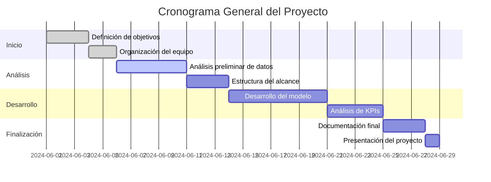

### ☕Proyecto:
# 📊 Análisis de Inversión
## 🥐 Coffee & Brunch Bussiness

## 📚Índice

| Sección                         | Enlace                           |
|--------------------------------|----------------------------------|
| **Items que tiene que tener la propuesta**          | [Equipo de trabajo](#equipo-de-trabajo) |
|                                | [Entendimiento de la situación actual](#entendimiento-de-la-situación-actual) |
|                                | [Objetivos](#objetivos)          |
|                                | [Alcance](#alcance)              |
|                   | [KPIs](#kpis)                    |
|          | [Repositorio Github](#repositorio-github) |
| **Hitos**                      |                                  |
|                         | [3KPIs](#kpis)                   |
| | [Alcance](#alcance)              |
|              | [EDA de los datos](#stack-tecnológico) |
|             | [Repositorio Github](#repositorio-github) |
|             | [Stack Tecnológico](#stack-tecnológico) |
|          | [Metodología de trabajo](#metodología-de-trabajo) |
|                | [Diseño detallado](#diseño-detallado) |
|        | [Cronograma general Gantt](#cronograma-general-gantt) |
| | [Análisis preliminar de calidad de datos](#análisis-preliminar-de-calidad-de-datos) |
| **Documentación:**                      |                                  |
|                                |     [Stack elegido y fundamentación](#Cronograma-general-Gantt)|
|                                |    [Flujo de trabajo](#Cronograma-general-Gantt)|

---

# Equipo de Trabajo:
Presentación de Nuestro Equipo de Ciencia de Datos

###### Claudia Jara y Saray Pacheco – Analistas de Datos
Expertas en explorar, interpretar y visualizar los datos, Claudia y Saray son clave para descubrir patrones, generar insights estratégicos y presentar información clara que facilita la toma de decisiones.

###### Diana Moreno y Sergio Castro – Ingenieros de Datos
Diana y Sergio se especializan en diseñar y mantener la infraestructura de datos, asegurando que la información sea accesible, eficiente y escalable para proyectos de alta complejidad.

###### Felipe Dedes y Greta Combold – Ingenieros de Machine Learning
Felipe y Greta lideran el desarrollo de modelos predictivos e implementan soluciones de machine learning que automatizan procesos y generan sistemas inteligentes con impacto real.

Juntos, combinamos nuestras habilidades para transformar datos en valor, aportando innovación y resultados efectivos.

[⬆️ Volver al índice](#índice)

¨
# Entendimiento de la situación actual
_"El mercado de cafeterías boutique y brunch está en pleno auge. La creciente demanda por experiencias gastronómicas únicas y la búsqueda de ambientes acogedores lo convierten en un sector atractivo, pero también competitivo.
Sin embargo, los principales desafíos para la expansión incluyen:
1- Identificar zonas con alta demanda potencial.
2- Evaluar la rentabilidad proyectada en cada ubicación.
3- Reducir riesgos asociados a la competencia y baja afluencia de público.
A partir de estos puntos clave, hemos diseñado un análisis que responde directamente a estas inquietudes y ofrece una guía estratégica basada en datos."_

[⬆️ Volver al índice](#índice)

# Objetivos 
###### Objetivo General 
Elaborar una propuesta de inversión basada en el análisis de información disponible sobre los
negocios de coffee and tea and breakfast en las plataformas Yelp y Google Maps (pendiente
incluir si encontramos más información) en Estados Unidos.
###### Objetivo Específicos:
1. Realizar un Análisis Exploratorio de los Datos disponibles en Yelp y Google maps (incluir
aquí la otra fuente de dato si aplica)
2. Realizar un ETL que permita integrar datos de diversas fuentes y transformarlos en una
estructura unificada.
3. Definir el pipeline
4. Realizar el despliegue de datos en nube que facilite la ingesta de datos y alimentar el
modelo de machine learning.
5. Desarrollar un modelo de machine learning para predecir las oportunidades de inversión
basadas en los KPIs definidos.
6. Elaborar un dashboard de los KPIs e información clave de consulta.!
7. 
[⬆️ Volver al índice](#índice)

# Alcance 
Este proyecto se centra en realizar un análisis integral del mercado para apoyar la expansión estratégica del negocio 'Coffee & Brunch Business'. Consideramos los siguientes puntos clave dentro del alcance:
1. Recopilación y procesamiento de datos provenientes de Yelp, Google Maps y otras fuentes relevantes.
2. Diseño e implementación de un ETL para integrar y estructurar los datos en un formato unificado.
3. Identificación de zonas de alto potencial mediante análisis geoespacial y evaluación de métricas clave.
4. Desarrollo de un modelo predictivo de machine learning para estimar oportunidades de inversión.
5. Creación de un dashboard interactivo para la visualización de KPIs e insights relevantes.
Este alcance está diseñado para ofrecer resultados accionables y maximizar el retorno de inversión, alineándose con los objetivos de crecimiento del negocio.

ALCANCE Este proyecto incluirá el análisis y limpieza de datos disponibles en Yelp y Google Maps para negocios de cofee and breakfast en Estados Unidos, la elaboración de un dashboard interactivo con la visualización de datos claves y Kpi y la implementación de un modelo de machine learning para predicciones y recomendaciones sobre la expansión de este tipo de negocio.
Este proyecto no incluye la Integración en tiempo real con las plataformas Yelp o google maps, análisis de información por fuera de Estados Unidos ni tampoco estrategías de marketing de expansión que se puede desarrollar en una siguiente etapa.
No incluye: Integración en tiempo real con las plataformas Yelp o google maps, analisis de información por fuera de Estados Unidos /ciudad seleecionada ni tampoco estrategías de marketing de expansión.

[⬆️ Volver al índice](#índice)

EDA: Análisis Exploratorio de Datos
"En estas dos primeras semanas, nos enfocamos en recopilar, limpiar y analizar datos de Google Maps y Yelp. Nuestro EDA inicial incluye:
Demografía y densidad poblacional: Identificar zonas con alta concentración de población objetivo.
Tráfico peatonal: Evaluar la afluencia promedio en las áreas seleccionadas.
Competencia: Mapear la presencia de negocios similares.
Presentaremos gráficos claros que reflejen tanto los datos generales como los resultados después de la limpieza. Por ejemplo, visualizaremos las áreas con mayor potencial versus las que presentan riesgos asociados a la saturación del mercado."

[⬆️ Volver al índice](#índice)
   [image](https://github.com/user-attachments/assets/14304345-62e7-4e1b-be19-f77f7ce2b86d)

 # KPIs
Los KPIs son indicadores clave que permiten medir el éxito de ciertos objetivos, y en este caso están enfocados en medir aspectos claves para un negocio en crecimiento, como lo son el aumento de comentarios positivos que den visibilidad al negocio y el aumento de la probabilidad de compra.

KPI1:
Nombre:Tasa de crecimiento de comentarios positivos
Descripción: Medir el porcentaje de crecimiento de la cantidad total de puntuaciones positivas con respecto al periodo inmediatamente anterior, esto permite monitorear de forma cuantificable la salud de la marca y satisfacción de los clientes.
Fórmula: 

% de crecimiento de comentarios positivos = [(Total comentarios positivos periodo actual - Total comentarios positivos periodo anterior) / Total de comentarios positivos periodo anterior] * 100

KPI2:
Nombre: Puntuación promedio
Descripción: Medir la satisfacción de los clientes representada por medio de la  puntuación que registran los usuarios para el negocio.
Fórmula: 

Puntaje promedio = Sumatoria total de los puntajes del periodo / Total usuarios que dejaron su calificación en el periodo.
[⬆️ Volver al índice](#índice)
## Stack Tecnológico
- [Indice](#indice)

[⬆️ Volver al índice](#índice)

## Cronograma General Gantt

El cronograma general del proyecto se detalla a continuación, dividido en secciones como inicio, análisis, desarrollo y finalización. Utilizamos un diagrama de Gantt para visualizar el progreso de cada tarea.

# Repositorio Github
El proyecto está organizado en diferentes ramas que abordan análisis, limpieza de datos y machine learning:

## Rama Principal (main) Sergio Castro
Descripción General
La rama principal contiene el proceso de ETL y la culminación del Análisis Exploratorio de Datos (EDA) del dataset Google. Esta rama sirve como base principal del proyecto, consolidando el trabajo inicial sobre los datos.

### Estructura de la Rama
#### ETL-google.ipynb

Notebook que realiza el proceso ETL (Extracción, Transformación y Carga) del dataset Google.
Contenido:
Extracción de datos crudos.
Transformación: limpieza, eliminación de valores nulos y duplicados.
Preparación de los datos para su posterior análisis y modelado.
Resultados finales del EDA, donde se exploran tendencias y características clave de los datos.
#### README.md

Archivo de documentación que describe la estructura y propósito del proyecto

#### Objetivos de la Rama Sergio Castro 
Realizar la preparación de datos con un proceso ETL sobre el dataset Google.
Culminar el Análisis Exploratorio de Datos (EDA) para comprender las tendencias y características principales del dataset.
Consolidar la base de datos lista para los siguientes análisis y modelado.

## Rama Diana Moreno
### Descripción General
Esta rama contiene el análisis exploratorio de datos (EDA) y el proceso de Extracción, Transformación y Carga (ETL) del dataset Yelp. El objetivo es preparar y analizar los datos para su uso posterior en el proyecto.

### Estructura de la Rama
#### EDA-YELP.ipynb

Notebook que realiza la Exploración de Datos (EDA) del dataset Yelp.
Contenido:
Análisis inicial de las características de los datos.
Identificación de valores nulos, duplicados y distribuciones.
Visualización de patrones y tendencias.

#### ETL-YELP.ipynb

Notebook que implementa el proceso de Extracción, Transformación y Carga (ETL) de los datos de Yelp.
Contenido:
Extracción de datos crudos.
Transformación: limpieza, eliminación de inconsistencias y creación de nuevas variables.
Preparación de los datos para análisis o modelado.
Objetivos de la Rama
Realizar un análisis exploratorio para entender la estructura y calidad del dataset Yelp.
Implementar un proceso de ETL para preparar los datos para futuros análisis y modelado.

[⬆️ Volver al índice](#índice)

### Contacto:
#### Claudia Jara Yañez:
Rol: Data Analyst
Github:https://github.com/claujara1975
Linkedin:

#### Saray Pacheco Ramos:
Rol: Data Analyst  
Github: https://github.com/ssaraypr
#### Sergio Castro: Limpieza y análisis del dataset Google.
Rol: Data Engineer
Github:https://github.com/SDCaFlo
LinkedIn: 
#### Diana Moreno: Limpieza y análisis del dataset Yelp.
Rol:  Data Engineer
Github: https://github.com/dianitafeliz
LinkedIn:
#### Felipe Dedes : Machine learning y despliegue.
Rol: Machine Learning Engineer
Github:https://github.com/DedesF
LinkedIn:
#### Greta Combold: Machine Learning y despliegue.
Rol: Machine Learning Engineer
Github: https://github.com/PerlaMarGreta
LinkedIn:
[⬆️ Volver al índice](#índice)
