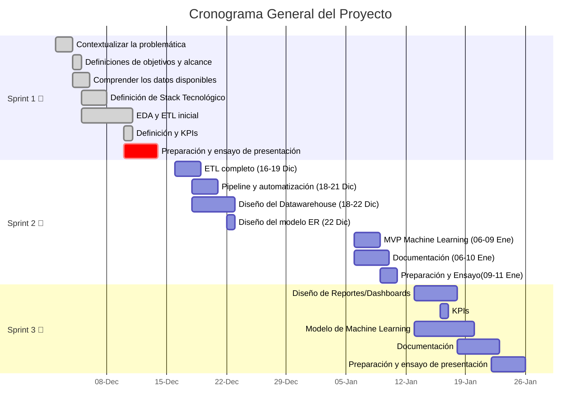

### 
  ☕Proyecto: 

# 
 📊 Análisis de Inversión 

## 
 🥐 Coffee & Brunch Bussiness 

## 📚Índice
 
| Sección                         | Enlace                           |
|--------------------------------|----------------------------------|
| **Items que tiene que tener la propuesta**          | [Equipo de trabajo](#equipo-de-trabajo) |
|                                | [Entendimiento de la situación actual](#entendimiento-de-la-situación-actual) |
|                                | [Objetivos](#objetivos)          |
|                                | [Alcance](#alcance)              |
|                   | [KPIs](#kpis)                    |
|          | [Repositorio Github](#repositorio-github) |
| **Hitos**                      |                                  |
|                         | [3KPIs](#kpis)                   |
| | [Alcance](#alcance)              |
|              | [EDA de los datos](#eda) |
|             | [Repositorio Github](#repositorio-github) |
|             | [Stack Tecnológico](#stack-tecnológico) |
|          | [Metodología de trabajo](#metodología-de-trabajo) |
|                | [Diseño detallado](#diseño-detallado) |
|        | [Cronograma general Gantt](#cronograma-general-gantt) |
| | [Análisis preliminar de calidad de datos](#análisis-preliminar-de-calidad-de-datos) |
| **Documentación:**                      |                                  |
|                                |     [Stack elegido y fundamentación](#Cronograma-general-Gantt)|
|                                |    [Flujo de trabajo](#Flujo-de-trabajo)|
 
---

# 🚀Equipo de Trabajo:
# ¿Quienes Somos? 

"Buenos días. Somos Datanova, un equipo especializado en transformar datos en soluciones estratégicas. Hoy queremos presentar nuestra propuesta para apoyar la expansión de su empresa, un negocio consolidado en el rubro de 'Coffee & Brunch Business'. Sabemos que desea abrir nuevos locales y confiamos en que este proyecto será clave para identificar las mejores oportunidades, minimizando riesgos y maximizando el retorno de su inversión.
Nuestro objetivo es simple: utilizar datos para transformar su visión en una estrategia ganadora."

Presentación de Nuestro Equipo de Ciencia de Datos
| 📊 **Analistas de Datos** | 🛠️ **Ingenieros de Datos** | 🤖 **Ingenieros de Machine Learning** |
|---------------------------|---------------------------|--------------------------------------|
|  |  |  |
| **Claudia Jara y Saray Pacheco**   Expertas en explorar, interpretar y visualizar los datos, Claudia y Saray son clave para descubrir patrones, generar insights estratégicos y presentar información clara que facilita la toma de decisiones. | **Diana Moreno y Sergio Castro**   Diana y Sergio se especializan en diseñar y mantener la infraestructura de datos, asegurando que la información sea accesible, eficiente y escalable para proyectos de alta complejidad. | **Felipe Dedes y Greta Combold**   Felipe y Greta lideran el desarrollo de modelos predictivos e implementan soluciones de machine learning que automatizan procesos y generan sistemas inteligentes con impacto real. |

## Juntos, combinamos nuestras habilidades para transformar datos en valor, aportando innovación y resultados efectivos.
***

[⬆️ Volver al índice](#índice)

*** 

¨
# 🔍📊Entendimiento de la situación actual
_"El mercado de cafeterías boutique y brunch está en pleno auge. La creciente demanda por experiencias gastronómicas únicas y la búsqueda de ambientes acogedores lo convierten en un sector atractivo, pero también competitivo.
Sin embargo, los principales desafíos para la expansión incluyen:

1- **Identificar zonas con alta demanda potencial.**

2- **Evaluar la rentabilidad proyectada en cada ubicación.**

3- **Reducir riesgos asociados a la competencia y baja afluencia de público.**

A partir de estos puntos clave, hemos diseñado un análisis que responde directamente a estas inquietudes y ofrece una guía estratégica basada en datos."_

[⬆️ Volver al índice](#índice)

# 🎯✨Objetivos 

###### Objetivo Específicos:
1. **Realizar un Análisis Exploratorio de los Datos disponibles en Yelp y Google maps (incluir
aquí la otra fuente de dato si aplica)**
2. **Realizar un ETL que permita integrar datos de diversas fuentes y transformarlos en una
estructura unificada.**
3. **Definir el pipeline**
4. **Realizar el despliegue de datos en nube que facilite la ingesta de datos y alimentar el
modelo de machine learning.**
5. **Desarrollar un modelo de machine learning para predecir las oportunidades de inversión
basadas en los KPIs definidos.**
6. **Elaborar un dashboard de los KPIs e información clave de consulta.**

[⬆️ Volver al índice](#índice)

# 📏🌍Alcance

Este proyecto se centra en realizar un análisis integral del mercado para apoyar la expansión estratégica del negocio 'Coffee & Brunch Business'. Consideramos los siguientes puntos clave dentro del alcance:
1. **Recopilación y procesamiento de datos provenientes de Yelp, Google Maps y otras fuentes relevantes.**
2. **Diseño e implementación de un ETL para integrar y estructurar los datos en un formato unificado.**
3. **Identificación de zonas de alto potencial mediante análisis geoespacial y evaluación de métricas clave.**
4. **Desarrollo de un modelo predictivo de machine learning para estimar oportunidades de inversión.**
5. **Creación de un dashboard interactivo para la visualización de KPIs e insights relevantes.**
Este alcance está diseñado para ofrecer resultados accionables y maximizar el retorno de inversión, alineándose con los objetivos de crecimiento del negocio.

ALCANCE Este proyecto incluirá el análisis y limpieza de datos disponibles en Yelp y Google Maps para negocios de cofee and breakfast en Estados Unidos, la elaboración de un dashboard interactivo con la visualización de datos claves y Kpi y la implementación de un modelo de machine learning para predicciones y recomendaciones sobre la expansión de este tipo de negocio.
Este proyecto no incluye la Integración en tiempo real con las plataformas Yelp o google maps, análisis de información por fuera de Estados Unidos ni tampoco estrategías de marketing de expansión que se puede desarrollar en una siguiente etapa.

[⬆️ Volver al índice](#índice)
***

# 📈🔎EDA
# Análisis Exploratorio de Datos
"En estas dos primeras semanas, nos enfocamos en recopilar, limpiar y analizar datos de Google Maps y Yelp. Nuestro EDA inicial incluye:
Demografía y densidad poblacional: Identificar zonas con alta concentración de población objetivo.
Tráfico peatonal: Evaluar la afluencia promedio en las áreas seleccionadas.
Competencia: Mapear la presencia de negocios similares.
Presentaremos gráficos claros que reflejen tanto los datos generales como los resultados después de la limpieza. Por ejemplo, visualizaremos las áreas con mayor potencial versus las que presentan riesgos asociados a la saturación del mercado."

Para la base de datos de YELP encontramos alrededor de 150 mil comercios, los cuales se encuentran ubicados en 1416 ciudades de estados unidos, y como nos muestra el primer gráfico se encuentran mayormente concentrados en la ciudad de philadelphia con un 9.7%, Tucson con un 6.15% y tampa con un 6%.

Como el negocio objetivo del cliente son los negocios dedicados al comercio de Coffee & Tea y Breakfast and brunch, el segundo gráfico nos muestra la cantidad de negocios en estas categorías.Para este caso contamos con 11.758 negocios de estas categorías ubicados en un total de 616 ciudades de Estados Unidos, y como podemos observar, la mayor parte de estos negocios los podemos encontrar, en philadelphia, tampa, new Orleans, Tucson y Nashville. Siento Philadelphia la ciudad con más negocios de este tipo en Estados Unidos.

En los datos de YELP también encontramos un poco más de 7 millones de reseñas escritas por los usuarios, de las cuales 1.147.000 corresponden a reseñas de la categoría Coffee and Breakfast.
En el gráfico de color azul, podemos ver la concentración de estas reseñas por ciudades, mostrando que en Philadelphia y New Orleans se encuentran la mayor cantidad de reseñas del todo el dataset.

Y, por último, tenemos un gráfico que nos muestra la cantidad de usuarios que han dejado reseñas en este tipo de comercios. 
Tenemos 574.000 usuarios con reseñas en las 616 ciudades, mostrando la mayor concentración de estos en Philadelphia, seguido por Tampa, New Orleans e Indianapolis.
Mostrando a Philadelphia como un gran destino para este tipo de negocios.

Para el dataset de google se analizaron un total 2,9 millones de negocios y 89.9 millones de reviews para el periodo de tiempo que conlleva desde abril-2002 hasta septiembre-2021.

Se identificaron un total de 4461 categorías distintas, de las cuales se tomaron las 50 categorías de comida más relevantes, que representan más del 90% de los reviews totales asociados a establecimientos de comida.

Wordcloud: Se extrajo las palabras con mayor aparición dentro de las 50 categorías top y se produjo el siguiente wordcloud. Aquí logramos identificar que las palabras más relevantes son:  "fast," "food", "takeout”, “pizza”, “coffee”, ‘cafe’.

## Rating Medio Categorías:

Teniendo en cuenta esto, calculamos el rating promedio de las categorías y observamos que los establecimientos asociados a Coffee presentan un rating mucho más elevado, en contraste con los locales de comida rápida, que se encuentran entre los peores calificados.

Establecimientos Unicos por Periodo: Despues de acotar nuestro locales a categorias asociadas a Coffee shops, evaluamos la presencia de establecimientos dentro de los reviews con una frecuencia trimestral. De esta manera, observamos que el sector se encuentra en crecimiento, a excepción de un periodo de decaída posiblemente asociado a la pandemia.

## Rating promedio por periodo:

A pesar de esta caída, notamos que el rating promedio de estos establecimientos ha ido en alza, lo que puede ser un indicador tanto de una mejora constante en el servicio debido a la competencia del sector, así como también una mejor aceptación del público a este tipo de establecimientos.

Conclusión: "Coffee" y "shop" son términos destacados, lo que indica la popularidad de cafeterías y lugares donde los consumidores buscan bebidas rápidas y espacios para socializar o trabajar. Esto es consistente con la cultura estadounidense, donde el café ocupa un lugar central.

[⬆️ Volver al índice](#índice)
***

 # 📊📏KPIs
 

En un mercado competitivo, el crecimiento y la salud de un negocio dependen de decisiones fundamentadas en datos. Por ello, hemos diseñado un sistema de medición basado en indicadores clave de desempeño (KPIs) que nos permitirán rastrear y optimizar aspectos esenciales como la satisfacción del cliente, la visibilidad del negocio y la conversión hacia compras efectivas. Este enfoque, sustentado por tecnología avanzada, buscará garantizar una gestión estratégica y escalable. 
proponer objetivo de crecimiento y cuanto tiempo
**KPI1:**

Nombre:Tasa de crecimiento de comentarios positivos
Objetivo: Monitorear la satisfacción de los clientes y la salud de la marca.
Métrica: ¿Está creciendo el volumen de opiniones positivas sobre nuestro negocio?
Descripción: mide el porcentaje de crecimiento de la cantidad total de puntuaciones positivas con respecto al periodo inmediatamente anterior
 
_Fórmula: % de crecimiento de comentarios positivos = [(Total comentarios positivos periodo actual - Total comentarios positivos periodo anterior) / Total de comentarios positivos periodo anterior] * 100_
 
**KPI2:**
Nombre: Puntuación promedio
Objetivo: Representar de forma cuantitativa la experiencia del cliente.
Métrica: Promedio de calificaciones otorgadas por los usuarios.
Descripción: Mide la satisfacción de los clientes representada por medio de la  puntuación que registran los usuarios para el negocio.

_Fórmula: Puntaje promedio = Sumatoria total de los puntajes del periodo / Total usuarios que dejaron su calificación en el periodo._
 
**KPI3**
Nombre: Tasa de crecimiento de las calificaciones
Objetivo: Incrementar la visibilidad del negocio atrayendo a más clientes a dejar reseñas.
Métrica: ¿Cuánto crecen las reseñas en cada periodo?
Descripción:  Medir el crecimiento de la cantidad de clientes que están dejando reseñas, lo que refleja la visibilidad del negocio.

_Fórmula: % de crecimiento de comentarios de las calificaciones = [(Total comentarios periodo actual - Total comentarios periodo anterior) / Total de comentarios periodo anterior] * 100_

Puntaje promedio = Sumatoria total de los puntajes del periodo / Total usuarios que dejaron su calificación en el periodo.

[⬆️ Volver al índice](#índice)
# Flujo de Trabajo
# 🚀Pipeline 

### 🌟 **Introducción**
Este proyecto implementa un pipeline de datos **robusto y escalable** que permite la **ingestión**, **transformación**, **almacenamiento** y **visualización** de datos. Además, incluye la integración de modelos de **Machine Learning** y **control de versiones** para garantizar calidad y reproducibilidad.

---

### 🔗 **Resumen del Pipeline**
**Flujo Completo**:  
**Data Source → Transform → Warehouse → Machine Learning → Visualization.

El pipeline cubre desde la ingestón de datos hasta la visualización, automatizando tareas y garantizando eficiencia.

---

### 🛠️ **Arquitectura del Pipeline**

1. **🛠️ Local Transform (Procesamiento Local)**:
   - Herramientas: **Apache Spark**, **Python** *(pandas, matplotlib, numpy)*.
   - Actividades: Exploratory Data Analysis (**EDA**), limpieza y transformaciones iniciales.

2. **💾 Data Source (Origen de Datos)**:
   - Fuentes de datos:
     - **APIs**: Google Map Places 📍, Yelp Fusion 🔎.
     - Subida manual: Archivos **CSV**, **JSON**.

3. **📈 Transform (Transformación de Datos)**:
   - **BigQuery** 📂: Almacenamiento y consulta SQL.
   - **Cloud Dataflow** 🛠️: Procesamiento escalable y en streaming.
   - **Cloud Functions** ⚙️: Automatización de tareas adicionales con Python.
   - **Cloud Scheduler** ⏰: Programación de tareas recurrentes.

4. **🏛️ Warehouse (Almacén de Datos)**:
   - **BigQuery** 📁: Actúa como **Data Warehouse** central.

5. **🤖 Machine Learning**:
   - Modelado con:
     - **TensorFlow** 💡 y **Scikit-learn** 🔬.
   - Despliegue con **Streamlit** 📺 para interfaces interactivas.

6. **📊 Visualization (Visualización de Datos)**:
   - Herramienta: **Power BI** 🔍.
   - Propósito: Dashboards interactivos para el análisis y presentación de resultados.

7. **🔒 Version Control (Control de Versiones)**:
   - **Git** ⚒️ y **GitHub** 💼: Control de versiones y colaboración.
   - **GitHub Actions** ⏳: Automatización de CI/CD.

---

### 🔄 **Flujo del Pipeline**
1. **💡 Ingestión de Datos**:
   - Datos obtenidos de **APIs** o subida manual.
2. **🛠️ Transformación Local**:
   - EDA y limpieza con **Apache Spark** y **Python**.
3. **💾 Carga a la Nube**:
   - Datos subidos a **BigQuery**.
4. **🛠️ Transformación en la Nube**:
   - Procesamiento con **Cloud Dataflow** y automatización con **Cloud Functions** y **Scheduler**.
5. **📁 Almacenamiento**:
   - Datos transformados almacenados en **BigQuery**.
6. **🤖 Machine Learning**:
   - Entrenamiento de modelos con **TensorFlow/Scikit-learn**.
   - Visualización de resultados con **Streamlit**.
7. **📊 Visualización Final**:
   - Dashboards interactivos con **Power BI**.
8. **⚒️ Control de Versiones**:
   - Automatización y control con **Git**, **GitHub** y **GitHub Actions**.

---

### 🧰 **Tecnologías Principales**
- **BigQuery** 📂: Almacenamiento y consulta de datos.
- **Cloud Dataflow** 🛠️: Procesamiento escalable.
- **TensorFlow / Scikit-learn** 🤖: Modelado de datos.
- **Streamlit** 📺: Interfaces interactivas.
- **Power BI** 🔍: Visualización de resultados.
- **Git / GitHub** 💼: Versionado y CI/CD.
- **APIs**: Google Map Places 📍, Yelp Fusion 🔎.

---

### 🚀 **Este pipeline está diseñado para ser escalable, automatizado y fácil de usar**. 🚀

[⬆️ Volver al índice](#índice)

## 🛠️🧩💻**Stack Tecnológico**

El pipeline utiliza un **stack de herramientas escalable** y eficiente:

### ⚙️ **Procesamiento de Datos**:
- **Apache Spark** 🛠️: Procesamiento distribuido.
- **Python** ✨: Lenguaje principal.
   - Bibliotecas: **pandas**, **numpy**, **matplotlib**.

### 📂 **Almacenamiento en la Nube**:
- **BigQuery**: Data Warehouse.
- **Cloud Dataflow**: Procesamiento escalable.
- **Cloud Functions**: Automatización.
- **Cloud Scheduler**: Programación de tareas.

### 🤖 **Machine Learning**:
- **TensorFlow / Scikit-learn**: Desarrollo y evaluación de modelos.
- **Streamlit**: Interfaces interactivas.

### 📊 **Visualización**:
- **Power BI**: Dashboards y análisis.

### ⚒️ **Control de Versiones**:
- **Git y GitHub**: Versionado del código.
- **GitHub Actions**: Automatización CI/CD.

### 💾 **Ingestión de Datos**:
- **APIs**: Google Map Places, Yelp Fusion.

---

### 🎯 **Beneficios del Stack**
- ✨ **Escalabilidad**: Manejo eficiente de grandes volúmenes.
- 🔄 **Automatización**: Menos procesos manuales.
- 🔒 **Reproducibilidad**: Versionado con Git/GitHub.
- 📺 **Interactividad**: Visualización clara con Streamlit y Power BI.

---

## 📝🧩 Metodología de trabajo

Para **organizar nuestro trabajo** y **dirigir nuestros esfuerzos** hacia nuestras metas, hemos elegido trabajar con **metodologías ágiles** bajo el marco de trabajo **SCRUM** 🚀.

Este enfoque nos permite:

- ✅ **Mejorar la organización de tareas**: Asignando responsabilidades claras y manejando tiempos eficientemente.  
- 🤝 **Fomentar la colaboración**: Promoviendo la comunicación constante y el trabajo en equipo.  
- 🔄 **Adaptarnos rápidamente a los cambios**: Flexibilidad ante nuevas necesidades o retos del proyecto.  
- 📦 **Asegurar entregas continuas**: Iteraciones incrementales que mantienen el producto alineado con nuestros objetivos.\n\nTrabajar bajo **SCRUM** nos garantiza un flujo de trabajo **transparente**, **eficiente** y **enfocado en la entrega de valor**, permitiendo la mejora continua durante todo el desarrollo.

---

[⬆️ Volver al índice](#índice)

## ⏳📅Cronograma General Gantt

El cronograma general del proyecto se detalla a continuación, dividido en secciones como inicio, análisis, desarrollo y finalización. Utilizamos un diagrama de Gantt para visualizar el progreso de cada tarea.

**Cronograma General: Hitos y Entregables**

"El proyecto está diseñado para ser entregado en seis semanas, con presentaciones cada dos semanas.

**Semana 1-2:**

EDA inicial con datos de Google Maps y Yelp.
Gráficos que muestren la información limpia y general.
Definición de KPIs y fórmulas, junto con las metas iniciales.

**Semana 3-4:**

Implementación de un modelo predictivo para analizar la rentabilidad de las zonas priorizadas.
Mapas interactivos que representen el análisis geoespacial.

**Semana 5-6:**
Finalización del dashboard interactivo.
Presentación de recomendaciones finales y conclusiones basadas en los KPIs.

**Hitos:**

Desarrollo de herramientas visuales.
Documentación clara del análisis.
Recomendaciones estratégicas accionables."

[⬆️ Volver al índice](#índice)

# 🔗📂Repositorio Github

  📂EDA
   
   Analisis Preliminar Google:  
      
   EDA Google: 
      
   Analisis Preliminar Yelp: 
      
   EDA Yelp:
      
  📂ETL
  
    ETL Google 
      
    ETL Yelp 
    
 📂Data
  
Google: 
 [Data Google](https://drive.google.com/drive/folders/1r-C75XM0gNzKiJPa97j-8HIiqtOzaz42)
     
Yelp: 
[Data Yelp](https://usantotomaseduco-my.sharepoint.com/personal/dianamorenoa_usantotomas_edu_co/_layouts/15/onedrive.aspx?id=%2Fpersonal%2Fdianamorenoa%5Fusantotomas%5Fedu%5Fco%2FDocuments%2FYELP%2Ddatasets&ga=1)

         
Census
      
  -- READ.ME

[⬆️ Volver al índice](#índice)

***
"Estamos convencidos de que este proyecto será el punto de partida para la expansión exitosa de su negocio. Nuestro trabajo no solo busca identificar ubicaciones rentables, sino también brindarle herramientas que faciliten decisiones basadas en datos sólidos y confiables.
Hoy le presentamos los primeros resultados de este proceso. A medida que avancemos, le mostraremos más hallazgos, siempre con la misión de maximizar su éxito en este sector tan competitivo."

### Contacto:
#### Claudia Jara Yañez:
Rol: Data Analyst

Github:https://github.com/claujara1975

Linkedin: https://www.linkedin.com/in/claudia-jara-1517361a5/

#### Saray Pacheco Ramos:
Rol: Data Analyst  

Github: https://github.com/ssaraypr

#### Sergio Castro: Limpieza y análisis del dataset Google.
Rol: Data Engineer

Github:https://github.com/SDCaFlo

LinkedIn: 
#### Diana Moreno: Limpieza y análisis del dataset Yelp.
Rol:  Data Engineer

Github: https://github.com/dianitafeliz

LinkedIn:
#### Felipe Dedes : Machine learning y despliegue.
Rol: Machine Learning Engineer

Github:https://github.com/DedesF

LinkedIn:
#### Greta Combold: Machine Learning y despliegue.
Rol: Machine Learning Engineer

Github: https://github.com/PerlaMarGreta

LinkedIn:

[⬆️ Volver al índice](#índice)
