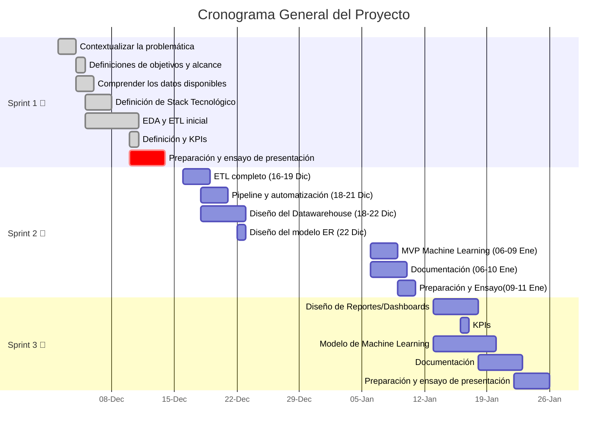

|  |  |  |
|:---:|:---:|:---:|
| [Ir a Sprint 1](#sprint-1) | [Ir a Sprint 2](#sprint-2) | [Ir a Sprint 3](#sprint-3) |

### 
  ☕Proyecto: 

# 
 📊 Análisis de Inversión 

## 
 🥐 Coffee & Brunch Bussiness 

# Sprint 1
## 📚Índice del SPRINT 1
 
| Sección                         | Enlace                           |
|--------------------------------|----------------------------------|
| **Items que tiene que tener la propuesta**          | [Equipo de trabajo](#equipo-de-trabajo) |
|                                | [Entendimiento de la situación actual](#entendimiento-de-la-situación-actual) |
|                                | [Objetivos](#objetivos)          |
|                                | [Alcance](#alcance)              |
|                   | [KPIs](#kpis)                    |
|          | [Repositorio Github](#repositorio-github) |
| **Hitos**                      |                                  |
|                         | [3KPIs](#kpis)                   |
| | [Alcance](#alcance)              |
|              | [EDA de los datos](#eda) |
|             | [Repositorio Github](#repositorio-github) |
|             | [Stack Tecnológico](#stack-tecnológico) |
|          | [Metodología de trabajo](#metodología-de-trabajo) |
|                | [Diseño detallado](#diseño-detallado) |
|        | [Cronograma general Gantt](#cronograma-general-gantt) |
| | [Análisis preliminar de calidad de datos](#análisis-preliminar-de-calidad-de-datos) |
| **Documentación:**                      |                                  |
|                                |     [Stack elegido y fundamentación](#Cronograma-general-Gantt)|
|                                |    [Flujo de trabajo](#Flujo-de-trabajo)|
 
---

# 🚀Equipo de Trabajo:
# ¿Quienes Somos? 

# ☕ **Datanova: Datos que Impulsan Decisiones Estratégicas**  

En **Datanova**, convertimos datos en herramientas clave para el crecimiento y la innovación. Nos complace presentar nuestra propuesta para **apoyar la expansión de su negocio**, un referente en el sector **Coffee & Brunch Business**.  

Nuestro enfoque está centrado en ayudarle a **identificar las mejores ubicaciones** para sus nuevos locales, reduciendo riesgos y maximizando el **potencial de retorno**.  

### 🎯 **Nuestra misión**  
Transformar sus objetivos en resultados concretos, aprovechando el poder de los datos para diseñar una **estrategia exitosa y sostenible**.

---
Presentación de Nuestro Equipo de Ciencia de Datos
| 📊 **Analistas de Datos** | 🛠️ **Ingenieros de Datos** | 🤖 **Ingenieros de Machine Learning** |
|---------------------------|---------------------------|--------------------------------------|
|  |  |  |
| **Claudia Jara y Saray Pacheco**   Expertas en explorar, interpretar y visualizar los datos, Claudia y Saray son clave para descubrir patrones, generar insights estratégicos y presentar información clara que facilita la toma de decisiones. | **Diana Moreno y Sergio Castro**   Diana y Sergio se especializan en diseñar y mantener la infraestructura de datos, asegurando que la información sea accesible, eficiente y escalable para proyectos de alta complejidad. | **Felipe Dedes y Greta Combold**   Felipe y Greta lideran el desarrollo de modelos predictivos e implementan soluciones de machine learning que automatizan procesos y generan sistemas inteligentes con impacto real. |

## Juntos, combinamos nuestras habilidades para transformar datos en valor, aportando innovación y resultados efectivos.
***

[⬆️ Volver al índice](#índice)

*** 

¨
# 🔍📊Entendimiento de la situación actual
_"El mercado de cafeterías boutique y brunch está en pleno auge. La creciente demanda por experiencias gastronómicas únicas y la búsqueda de ambientes acogedores lo convierten en un sector atractivo, pero también competitivo.
Sin embargo, los principales desafíos para la expansión incluyen:

1- **Identificar zonas con alta demanda potencial.**

2- **Evaluar la rentabilidad proyectada en cada ubicación.**

3- **Reducir riesgos asociados a la competencia y baja afluencia de público.**

A partir de estos puntos clave, hemos diseñado un análisis que responde directamente a estas inquietudes y ofrece una guía estratégica basada en datos."_

[⬆️ Volver al índice](#índice)

# 🎯✨Objetivos 

###### Objetivo Específicos:
1. **Realizar un Análisis Exploratorio de los Datos disponibles en Yelp y Google maps (incluir
aquí la otra fuente de dato si aplica)**
2. **Realizar un ETL que permita integrar datos de diversas fuentes y transformarlos en una
estructura unificada.**
3. **Definir el pipeline**
4. **Realizar el despliegue de datos en nube que facilite la ingesta de datos y alimentar el
modelo de machine learning.**
5. **Desarrollar un modelo de machine learning para predecir las oportunidades de inversión
basadas en los KPIs definidos.**
6. **Elaborar un dashboard de los KPIs e información clave de consulta.**

[⬆️ Volver al índice](#índice)

# 📏🌍Alcance

Este proyecto se centra en realizar un análisis integral del mercado para apoyar la expansión estratégica del negocio 'Coffee & Brunch Business'. Consideramos los siguientes puntos clave dentro del alcance:
1. **Recopilación y procesamiento de datos provenientes de Yelp, Google Maps y otras fuentes relevantes.**
2. **Diseño e implementación de un ETL para integrar y estructurar los datos en un formato unificado.**
3. **Identificación de zonas de alto potencial mediante análisis geoespacial y evaluación de métricas clave.**
4. **Desarrollo de un modelo predictivo de machine learning para estimar oportunidades de inversión.**
5. **Creación de un dashboard interactivo para la visualización de KPIs e insights relevantes.**
Este alcance está diseñado para ofrecer resultados accionables y maximizar el retorno de inversión, alineándose con los objetivos de crecimiento del negocio.

ALCANCE Este proyecto incluirá el análisis y limpieza de datos disponibles en Yelp y Google Maps para negocios de cofee and breakfast en Estados Unidos, la elaboración de un dashboard interactivo con la visualización de datos claves y Kpi y la implementación de un modelo de machine learning para predicciones y recomendaciones sobre la expansión de este tipo de negocio.
Este proyecto no incluye la Integración en tiempo real con las plataformas Yelp o google maps, análisis de información por fuera de Estados Unidos ni tampoco estrategías de marketing de expansión que se puede desarrollar en una siguiente etapa.

[⬆️ Volver al índice](#índice)
***

# 📈🔎EDA
# Análisis Exploratorio de Datos
 
Durante las primeras dos semanas, nos enfocamos en la **recopilación**, **limpieza** y **análisis de datos** provenientes de **Google Maps** y **Yelp**.  

El objetivo principal de este **Análisis Exploratorio de Datos (EDA)** fue identificar **oportunidades estratégicas** para su negocio a través de los siguientes enfoques clave:  

---

### 🚀 **1. Crecimiento**  
- Identificar **zonas** con alta concentración de la **población objetivo** y **potencial de expansión**.  

---

### 🗺️ **2. Competencia**  
- Mapear la **presencia** y **distribución** de negocios similares para evaluar la **densidad competitiva**.

---

### ⭐ **3. Factores Clave de Éxito**  
- Detectar **atributos comunes** en los negocios más exitosos, tales como:  
   - 📍 **Ubicación estratégica**  
   - 🛎️ **Características del servicio**  
   - 😊 **Nivel de satisfacción del cliente**  

---

## 📈 **Resultados y Visualizaciones**  

Presentaremos **visualizaciones claras y precisas** que mostrarán:  
1. 🗂️ Los **datos brutos** recopilados.  
2. 🧹 Los resultados tras la **limpieza y análisis**.  

Por ejemplo, destacaremos:  
- 🌟 Áreas con **mayor potencial de crecimiento**.  
- ⚠️ Zonas que presentan **riesgos** debido a la **saturación del mercado**.  

---

## 🎯 **Conclusión**  
Estas conclusiones servirán como base para **identificar las mejores oportunidades de negocio**, facilitando la toma de decisiones **estratégicas** y **rentables**. 🚀  

---

---

## 📊 **Análisis de la Base de Datos de Yelp**  

### 🗺️ **Distribución General de Comercios**  
En la base de datos de **Yelp**, identificamos aproximadamente **150,000 comercios** ubicados en **1,416 ciudades** de **Estados Unidos**.  

🔍 Como lo muestra el **primer gráfico**, las ciudades con mayor concentración de negocios son:  
- **🏙️ Philadelphia**: 9.7%  
- **🌵 Tucson**: 6.15%  
- **🌴 Tampa**: 6%  

---

### ☕ **Negocios en las Categorías Objetivo**  
Dado que el foco del cliente está en negocios de **Coffee & Tea** y **Breakfast & Brunch**, analizamos estas categorías en detalle.  

📊 El **segundo gráfico** revela:  
- **Total de negocios**: **11,758**  
- **Ciudades analizadas**: **616 ciudades** de Estados Unidos  

### 🌟 **Ciudades con Mayor Concentración**  
Los negocios de **Coffee & Tea** y **Breakfast & Brunch** se encuentran mayormente en:  
- 🏙️ **Philadelphia**  
- 🌴 **Tampa**  
- 🎷 **New Orleans**  
- 🌵 **Tucson**  
- 🎸 **Nashville**  

🔝 **Philadelphia** se destaca como la ciudad con la **mayor cantidad de negocios** en estas categorías en todo Estados Unidos.  

---

## 🎯 **Conclusión**  
El análisis de la base de datos de **Yelp** permite identificar ciudades estratégicas para la expansión del negocio, destacando **Philadelphia** como la ciudad líder en este segmento.  

--- 

## 📝 **Análisis de Reseñas de la Base de Datos de Yelp**  

### 🔎 **Resumen General de Reseñas**  
En la base de datos de **Yelp**, encontramos:  
- **7 millones de reseñas** escritas por los usuarios.  
- **1,147,000 reseñas** corresponden a la categoría **Coffee & Breakfast**.  

---

### 📊 **Distribución de Reseñas por Ciudades**  
El **gráfico azul** revela la concentración de reseñas por ciudad, destacando:  
- 🏙️ **Philadelphia**  
- 🎷 **New Orleans**  

Estas dos ciudades concentran la **mayor cantidad de reseñas** del dataset, lo que indica un **alto interés del público** en estos negocios en dichas ubicaciones.  

---

### 👥 **Cantidad de Usuarios con Reseñas**  
En cuanto a los **usuarios** que han dejado reseñas en negocios de **Coffee & Breakfast**, identificamos:  
- **574,000 usuarios** activos.  
- Distribuidos en **616 ciudades**.  

Las ciudades con **mayor cantidad de usuarios** son:  
- 🏙️ **Philadelphia**  
- 🌴 **Tampa**  
- 🎷 **New Orleans**  
- 🏁 **Indianápolis**  

---

## 🌟 **Conclusión**  
Los datos reafirman a **Philadelphia** como un destino **clave y estratégico** para este tipo de negocios, al concentrar tanto la **mayor cantidad de reseñas** como de **usuarios activos**.  

---

### 📌 **Puntos Destacados**  
- **Reseñas Totales**: **7M**  
- **Reseñas Coffee & Breakfast**: **1.1M**  
- **Usuarios con Reseñas**: **574K**  
- **Liderazgo por Ciudad**: 🏙️ **Philadelphia**  

---

---

## 🗂️ **Análisis del Dataset de Google**  

Para el dataset de **Google**, se analizaron:  
- 📊 **2.9 millones de negocios**  
- 📝 **89.9 millones de reviews**  
- 📅 Periodo: **Abril 2002 - Septiembre 2021**  

---

### 📑 **Categorías de Análisis**  
- Se identificaron **4,461 categorías distintas**.  
- Seleccionamos las **50 categorías de comida más relevantes**, las cuales representan **más del 90%** de los reviews totales asociados a establecimientos de comida.  

---

### ☁️ **Wordcloud: Palabras Más Relevantes**  
A partir de las **50 categorías principales**, extrajimos las palabras con mayor aparición y generamos la siguiente **nube de palabras** (Wordcloud).  

🔍 Las palabras más relevantes identificadas fueron:  
- **"fast"**, **"food"**, **"takeout"**, **"pizza"**, **"coffee"**, **"cafe"**  

📝 **Interpretación**:  
Esto sugiere que la categoría **coffee** tiene una **fuerte presencia** en el mercado de comida estadounidense.  

---

### ⭐ **Rating Medio por Categoría**  
Al calcular el **rating promedio** de las categorías, observamos lo siguiente:  
- ☕ Los establecimientos asociados a **Coffee** presentan un **rating elevado**, lo que indica una **alta satisfacción del cliente**.  
- 🍟 En contraste, los locales de **comida rápida** (Fast Food) se encuentran entre los **peores calificados**.  

---

## 🎯 **Conclusión**  
El análisis destaca que los negocios de **Coffee** no solo tienen una **fuerte presencia en el mercado**, sino que también son percibidos con **alta calidad** por parte de los consumidores. En comparación, los negocios de **comida rápida** muestran una menor calificación promedio, lo que refleja oportunidades para mejorar en este segmento.  

---

## 📊 **Análisis de Tendencias en Coffee Shops**  

### 🗓️ **Establecimientos Únicos por Periodo**  
Tras filtrar los locales a categorías asociadas a **Coffee Shops**, evaluamos la **frecuencia trimestral** de establecimientos presentes en los reviews.  

🔍 **Hallazgos**:  
- El sector muestra una **tendencia de crecimiento constante**.  
- 📉 Se identificó un periodo de **decaída** que podría estar asociado a la **pandemia**, reflejando su impacto temporal en el sector.  

---

### ⭐ **Rating Promedio por Periodo**  
A pesar de la caída en la cantidad de establecimientos durante la pandemia:  
- 📈 El **rating promedio** de los coffee shops ha mostrado un **aumento constante** a lo largo del tiempo.  

### 🔎 **Posible Interpretación**:  
- **Competencia del sector**: La mejora en el **servicio y calidad** como respuesta a un mercado más exigente.  
- ☕ **Aceptación del público**: Mayor preferencia por este tipo de establecimientos, donde el café y el ambiente social juegan un papel importante.  

---

### 📌 **Conclusión General**  
Los términos **"coffee"** y **"shop"** destacan en el análisis, lo cual refleja:  
- ☕ La **popularidad** de las cafeterías como espacios clave para **socializar** y **trabajar**.  
- 🇺🇸 Una consistencia con la **cultura estadounidense**, donde el café ocupa un lugar **central** en la rutina diaria.  

---

## 🎯 **Relevancia para el Negocio**  
El crecimiento sostenido y la alta aceptación del público por los **coffee shops** los posicionan como una **oportunidad estratégica** para nuevos emprendimientos en el sector.  

--- 

---

## 🗺️ **Relación entre Coffee-Shops y Densidad Poblacional**  

### 🔥 **Mapa de Calor: Distribución de Coffee-Shops**  
En el **mapa de calor** (izquierda), podemos observar la **concentración de establecimientos de coffee-shops** en Estados Unidos:  
- 📍 Mayor densidad en las **costas este y oeste**, destacando a **New York** como el estado con mayor presencia.  
- 🏜️ Menor densidad en la zona **central** del país, especialmente en estados como **Nevada**, **Wyoming** y **Montana**.  

---

### 🗺️ **Mapa Coroplético: Densidad Poblacional**  
El **mapa coroplético** (derecha), generado con datos del **United States Census Bureau**, muestra la **densidad poblacional** por condado.  

### 🔎 **Comparación Visual**  
Al comparar ambos mapas:  
- Se observa una **relación directa** entre la **densidad poblacional** y la **cantidad de coffee-shops**.  
- 📈 Las zonas con **mayor densidad de población** tienden a tener una **mayor concentración** de establecimientos.  

---

### 📉 **Análisis de Correlación**  
- El cálculo de correlación lineal arroja un valor de **0.45**, lo que indica una **relación moderada** entre ambos factores.  
- Sin embargo, esta correlación **no es lo suficientemente fuerte** como para ser un **predictor confiable** por sí sola.  

---

## 🎯 **Conclusión Estratégica**  
Para el negocio de **coffee shops**:  
- La **densidad poblacional** es un factor **importante**, pero **no definitivo**.  
- Es crucial analizar otros factores que podrían influir en la **presencia** y el **éxito** del rubro, como:  
   - 📍 **Ubicación y accesibilidad**  
   - 👥 **Perfil demográfico del consumidor**  
   - 🛠️ **Nivel de competencia local**  
   - 💼 **Tendencias de consumo y hábitos de los usuarios**  

---

[⬆️ Volver al índice](#índice)
***

 # 📊📏KPIs

# 📊 **Indicadores Clave de Desempeño (KPIs)**  

En un **mercado competitivo**, el éxito y crecimiento de un negocio dependen de **decisiones fundamentadas en datos**. Por ello, hemos diseñado un sistema de medición basado en **Indicadores Clave de Desempeño (KPIs)** que permiten **rastrear y optimizar** aspectos esenciales como:  

- 📈 **Satisfacción del cliente**  
- 🔍 **Visibilidad del negocio**  
- 🛒 **Conversión hacia compras efectivas**  

Este enfoque, sustentado en **tecnología avanzada**, asegura una gestión **estratégica y escalable**.

## ✨ **KPIs Definidos**  

 

### 📌 **KPI 1: Sentimiento  --> Meta trimestral = 5%** 
S (Crecimiento de comentarios positivos)
- **Descripción**:  
   Monitorea el **sentimiento de los comentarios** para conocer la **opinión del consumidor**. Se calcula como el **porcentaje de comentarios positivos** respecto al total de comentarios del periodo.  
- **Fórmula**:  
  
Fórmula: % de crecimiento de comentarios positivos = [(Total comentarios positivos periodo actual - Total comentarios positivos periodo anterior) / Total de comentarios positivos periodo anterior] * 100

- **Meta**: ✅ **5%**  

---

**KPI2:**

### ⭐ **KPI 2: Puntuación Promedio**  
- **Descripción**:  
   Mide el **promedio de las calificaciones** dejadas por los usuarios durante un periodo, reflejando la **satisfacción del cliente** de manera cuantitativa.  
- **Fórmula**:  
   
   \text{Puntaje promedio} = \frac{\text{Sumatoria total de puntajes del periodo}}{\text{Total de usuarios que dejaron calificación}}
   
- **Meta**: ✅ **3.8**  

---
 
**KPI3**

### 🚀 **KPI 3: Tasa de Crecimiento de las Calificaciones**  
- **Descripción**:  
   Monitorea el **crecimiento de la visibilidad** del negocio basado en el **número de reseñas** recibidas en el periodo.  
- **Fórmula**:  
   \[
   \text{Porcentaje de crecimiento de calificaciones} = \frac{\text{(Total comentarios periodo actual - Total comentarios periodo anterior)}}{\text{Total comentarios periodo anterior}} \times 100
   \]  
- **Meta**: ✅ **2%**
- ---

---

## 🎯 **Resumen**  
Estos **KPIs** nos permitirán analizar y mejorar continuamente el desempeño del negocio, asegurando una **mejor experiencia del cliente**, mayor visibilidad y un crecimiento sostenible. 🚀 

[⬆️ Volver al índice](#índice)
# Flujo de Trabajo

# 🚀Pipeline 

### 🌟 **Introducción**
Este proyecto implementa un pipeline de datos **robusto y escalable** que permite la **ingestión**, **transformación**, **almacenamiento** y **visualización** de datos. Además, incluye la integración de modelos de **Machine Learning** y **control de versiones** para garantizar calidad y reproducibilidad.

---

### 🔗 **Resumen del Pipeline**
**Flujo Completo**:  
**Data Source → Transform → Warehouse → Machine Learning → Visualization.

El pipeline cubre desde la ingestón de datos hasta la visualización, automatizando tareas y garantizando eficiencia.

---

### 🛠️ **Arquitectura del Pipeline**

1. **🛠️ Local Transform (Procesamiento Local)**:
   - Herramientas: **Apache Spark**, **Python** *(pandas, matplotlib, numpy)*.
   - Actividades: Exploratory Data Analysis (**EDA**), limpieza y transformaciones iniciales.

2. **💾 Data Source (Origen de Datos)**:
   - Fuentes de datos:
     - **APIs**: Google Map Places 📍, Yelp Fusion 🔎.
     - Subida manual: Archivos **CSV**, **JSON**.

3. **📈 Transform (Transformación de Datos)**:
   - **BigQuery** 📂: Almacenamiento y consulta SQL.
   - **Cloud Dataflow** 🛠️: Procesamiento escalable y en streaming.
   - **Cloud Functions** ⚙️: Automatización de tareas adicionales con Python.
   - **Cloud Scheduler** ⏰: Programación de tareas recurrentes.

4. **🏛️ Warehouse (Almacén de Datos)**:
   - **BigQuery** 📁: Actúa como **Data Warehouse** central.

5. **🤖 Machine Learning**:
   - Modelado con:
     - **TensorFlow** 💡 y **Scikit-learn** 🔬.
   - Despliegue con **Streamlit** 📺 para interfaces interactivas.

6. **📊 Visualization (Visualización de Datos)**:
   - Herramienta: **Power BI** 🔍.
   - Propósito: Dashboards interactivos para el análisis y presentación de resultados.

7. **🔒 Version Control (Control de Versiones)**:
   - **Git** ⚒️ y **GitHub** 💼: Control de versiones y colaboración.
   - **GitHub Actions** ⏳: Automatización de CI/CD.

---

### 🔄 **Flujo del Pipeline**
1. **💡 Ingestión de Datos**:
   - Datos obtenidos de **APIs** o subida manual.
2. **🛠️ Transformación Local**:
   - EDA y limpieza con **Apache Spark** y **Python**.
3. **💾 Carga a la Nube**:
   - Datos subidos a **BigQuery**.
4. **🛠️ Transformación en la Nube**:
   - Procesamiento con **Cloud Dataflow** y automatización con **Cloud Functions** y **Scheduler**.
5. **📁 Almacenamiento**:
   - Datos transformados almacenados en **BigQuery**.
6. **🤖 Machine Learning**:
   - Entrenamiento de modelos con **TensorFlow/Scikit-learn**.
   - Visualización de resultados con **Streamlit**.
7. **📊 Visualización Final**:
   - Dashboards interactivos con **Power BI**.
8. **⚒️ Control de Versiones**:
   - Automatización y control con **Git**, **GitHub** y **GitHub Actions**.

---

### 🧰 **Tecnologías Principales**
- **BigQuery** 📂: Almacenamiento y consulta de datos.
- **Cloud Dataflow** 🛠️: Procesamiento escalable.
- **TensorFlow / Scikit-learn** 🤖: Modelado de datos.
- **Streamlit** 📺: Interfaces interactivas.
- **Power BI** 🔍: Visualización de resultados.
- **Git / GitHub** 💼: Versionado y CI/CD.
- **APIs**: Google Map Places 📍, Yelp Fusion 🔎.

---

### 🚀 **Este pipeline está diseñado para ser escalable, automatizado y fácil de usar**. 🚀

[⬆️ Volver al índice](#índice)

## 🛠️🧩💻**Stack Tecnológico**

El pipeline utiliza un **stack de herramientas escalable** y eficiente:

### ⚙️ **Procesamiento de Datos**:
- **Apache Spark** 🛠️: Procesamiento distribuido.
- **Python** ✨: Lenguaje principal.
   - Bibliotecas: **pandas**, **numpy**, **matplotlib**.

### 📂 **Almacenamiento en la Nube**:
- **BigQuery**: Data Warehouse.
- **Cloud Dataflow**: Procesamiento escalable.
- **Cloud Functions**: Automatización.
- **Cloud Scheduler**: Programación de tareas.

### 🤖 **Machine Learning**:
- **TensorFlow / Scikit-learn**: Desarrollo y evaluación de modelos.
- **Streamlit**: Interfaces interactivas.

### 📊 **Visualización**:
- **Power BI**: Dashboards y análisis.

### ⚒️ **Control de Versiones**:
- **Git y GitHub**: Versionado del código.
- **GitHub Actions**: Automatización CI/CD.

### 💾 **Ingestión de Datos**:
- **APIs**: Google Map Places, Yelp Fusion.

---

### 🎯 **Beneficios del Stack**
- ✨ **Escalabilidad**: Manejo eficiente de grandes volúmenes.
- 🔄 **Automatización**: Menos procesos manuales.
- 🔒 **Reproducibilidad**: Versionado con Git/GitHub.
- 📺 **Interactividad**: Visualización clara con Streamlit y Power BI.

---

## 📝🧩 Metodología de trabajo

Para **organizar nuestro trabajo** y **dirigir nuestros esfuerzos** hacia nuestras metas, hemos elegido trabajar con **metodologías ágiles** bajo el marco de trabajo **SCRUM** 🚀.

Este enfoque nos permite:

- ✅ **Mejorar la organización de tareas**: Asignando responsabilidades claras y manejando tiempos eficientemente.  
- 🤝 **Fomentar la colaboración**: Promoviendo la comunicación constante y el trabajo en equipo.  
- 🔄 **Adaptarnos rápidamente a los cambios**: Flexibilidad ante nuevas necesidades o retos del proyecto.  
- 📦 **Asegurar entregas continuas**: Iteraciones incrementales que mantienen el producto alineado con nuestros objetivos.\n\nTrabajar bajo **SCRUM** nos garantiza un flujo de trabajo **transparente**, **eficiente** y **enfocado en la entrega de valor**, permitiendo la mejora continua durante todo el desarrollo.

---

[⬆️ Volver al índice](#índice)

## ⏳📅Cronograma General Gantt

El cronograma general del proyecto se detalla a continuación, dividido en secciones como inicio, análisis, desarrollo y finalización. Utilizamos un diagrama de Gantt para visualizar el progreso de cada tarea.

**Cronograma General: Hitos y Entregables**

"El proyecto está diseñado para ser entregado en seis semanas, con presentaciones cada dos semanas.

**Semana 1-2:**

EDA inicial con datos de Google Maps y Yelp.
Gráficos que muestren la información limpia y general.
Definición de KPIs y fórmulas, junto con las metas iniciales.

**Semana 3-4:**

Implementación de un modelo predictivo para analizar la rentabilidad de las zonas priorizadas.
Mapas interactivos que representen el análisis geoespacial.

**Semana 5-6:**
Finalización del dashboard interactivo.
Presentación de recomendaciones finales y conclusiones basadas en los KPIs.

**Hitos:**

Desarrollo de herramientas visuales.
Documentación clara del análisis.
Recomendaciones estratégicas accionables."

[⬆️ Volver al índice](#índice)

# 🔗📂Repositorio Github

  📂EDA
   
   Analisis Preliminar Google:  
      
   EDA Google: 
      
   Analisis Preliminar Yelp: 
      
   EDA Yelp:
      
  📂ETL
  
    ETL Google 
      
    ETL Yelp 
    
 📂Data
  
Google: 
 [Data Google](https://drive.google.com/drive/folders/1r-C75XM0gNzKiJPa97j-8HIiqtOzaz42)
     
Yelp: 
[Data Yelp](https://usantotomaseduco-my.sharepoint.com/personal/dianamorenoa_usantotomas_edu_co/_layouts/15/onedrive.aspx?id=%2Fpersonal%2Fdianamorenoa%5Fusantotomas%5Fedu%5Fco%2FDocuments%2FYELP%2Ddatasets&ga=1)

         
Census
      
  -- READ.ME

[⬆️ Volver al índice](#índice)

***
"Estamos convencidos de que este proyecto será el punto de partida para la expansión exitosa de su negocio. Nuestro trabajo no solo busca identificar ubicaciones rentables, sino también brindarle herramientas que faciliten decisiones basadas en datos sólidos y confiables.
Hoy le presentamos los primeros resultados de este proceso. A medida que avancemos, le mostraremos más hallazgos, siempre con la misión de maximizar su éxito en este sector tan competitivo."

### Contacto:
#### Claudia Jara Yañez:
Rol: Data Analyst

Github:https://github.com/claujara1975

Linkedin: https://www.linkedin.com/in/claudia-jara-1517361a5/

#### Saray Pacheco Ramos:
Rol: Data Analyst  

Github: https://github.com/ssaraypr

#### Sergio Castro: Limpieza y análisis del dataset Google.
Rol: Data Engineer

Github:https://github.com/SDCaFlo

LinkedIn: 
#### Diana Moreno: Limpieza y análisis del dataset Yelp.
Rol:  Data Engineer

Github: https://github.com/dianitafeliz

LinkedIn:
#### Felipe Dedes : Machine learning y despliegue.
Rol: Machine Learning Engineer

Github:https://github.com/DedesF

LinkedIn:
#### Greta Combold: Machine Learning y despliegue.
Rol: Machine Learning Engineer

Github: https://github.com/PerlaMarGreta

LinkedIn:

[⬆️ Volver al índice](#índice)
